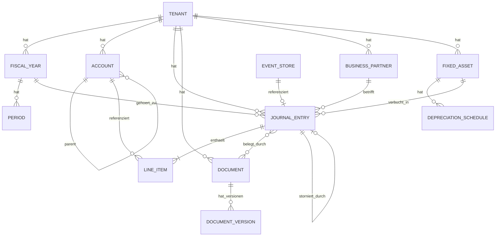

# Technische Architektur: KI-gestuetzte GmbH-Buchhaltungssoftware

## Inhaltsverzeichnis

1. [Systemarchitektur](#1-systemarchitektur)
2. [Datenmodell](#2-datenmodell)
3. [API-Endpunkte](#3-api-endpunkte)
4. [GoBD-Compliance](#4-gobd-compliance-in-der-technik)
5. [Schnittstellen](#5-schnittstellen)
6. [Claude Code Integration](#6-claude-code-integration)
7. [Sicherheit](#7-sicherheit)
8. [Vergleich existierender Loesungen](#8-vergleich-existierender-loesungen)
9. [Deployment und Betrieb](#9-deployment-und-betrieb)

---

## 1. Systemarchitektur

### 1.1 Architektur-Ueberblick

```
+------------------------------------------------------------------+
|                        Claude Code / KI-Client                    |
|  (MCP Server + Skills + Tool-Definitionen)                       |
+----------------------------------+-------------------------------+
                                   |
                              HTTPS/REST
                                   |
+----------------------------------v-------------------------------+
|                         API Gateway                               |
|  (Rate Limiting, Auth, Request Routing, API Versioning)          |
+----------------------------------+-------------------------------+
                                   |
                 +-----------------+-----------------+
                 |                 |                 |
        +--------v------+  +------v-------+  +------v-------+
        | Buchungs-     |  | Beleg-       |  | Reporting-   |
        | Service       |  | Service      |  | Service      |
        | (Command)     |  | (Command)    |  | (Query)      |
        +--------+------+  +------+-------+  +------+-------+
                 |                 |                 |
        +--------v-----------------v-----------------v-------+
        |                   Event Store                       |
        |              (PostgreSQL + Append-Only)             |
        +--------+--------------------------------------------+
                 |
        +--------v--------------------------------------------+
        |              Read Models / Projektionen              |
        |  (Kontensalden, Bilanzdaten, BWA, USt-Positionen)   |
        +-----------------------------------------------------+
```

### 1.2 API-First Design: REST

**Empfehlung: REST mit OpenAPI 3.1 Spezifikation**

Begruendung:
- REST ist fuer Claude als Tool-Consumer ideal (einfache HTTP-Aufrufe)
- OpenAPI-Spezifikation kann direkt als MCP-Tool-Definition dienen
- Breitere Tooling-Unterstuetzung (Swagger UI, Code-Generierung)
- GraphQL waere Overengineering fuer den primaeren Use-Case (Claude als einziger Client)

```yaml
# openapi.yaml (Auszug)
openapi: "3.1.0"
info:
  title: "GmbH-Buchhaltungs-API"
  version: "1.0.0"
paths:
  /api/v1/journal-entries:
    post:
      operationId: createJournalEntry
      summary: "Buchungssatz erstellen"
      requestBody:
        content:
          application/json:
            schema:
              $ref: "#/components/schemas/JournalEntryCreate"
      responses:
        "201":
          description: "Buchung erfolgreich erstellt"
```

### 1.3 Modularer Monolith (empfohlen fuer Phase 1)

**Empfehlung: Modularer Monolith statt Microservices**

Begruendung:
- Geringere operationale Komplexitaet in der Anfangsphase
- Einfacheres Deployment und Debugging
- Spaetere Aufteilung in Services moeglich, wenn noetig
- Ein Team, ein Deployment, volle Kontrolle

```
src/
  modules/
    journal/           # Buchungssaetze, Stornierungen
    accounts/          # Kontenplan, Salden
    documents/         # Belege, OCR
    reporting/         # Bilanz, GuV, BWA, USt-VA
    tax/               # ELSTER, E-Bilanz
    banking/           # FinTS, CAMT, MT940
    master_data/       # Firmen, Geschaeftsjahre
    audit/             # Audit Trail, GoBD
  core/
    events.py          # Event Store Infrastruktur
    auth.py            # Authentifizierung
    database.py        # DB-Verbindung
  api/
    v1/                # API Router v1
```

### 1.4 Event Sourcing fuer Buchfuehrung

Event Sourcing ist ideal fuer Buchhaltung, da es ein natuerliches Audit Trail bietet. Jede Aenderung wird als unveraenderliches Event gespeichert -- perfekt fuer GoBD-Compliance.

**Kernprinzipien:**
- Buchungen werden nie geloescht oder geaendert (Append-Only)
- Stornierung erzeugt ein neues Gegen-Event
- Der aktuelle Zustand wird aus der Event-Historie berechnet
- Jedes Event erhaelt einen Zeitstempel und eine fortlaufende Sequenznummer

```python
# Beispiel: Event-Typen fuer Buchfuehrung
from enum import Enum
from datetime import datetime
from pydantic import BaseModel
from decimal import Decimal
from uuid import UUID

class JournalEventType(str, Enum):
    ENTRY_CREATED = "journal.entry.created"
    ENTRY_POSTED = "journal.entry.posted"       # Festgeschrieben
    ENTRY_REVERSED = "journal.entry.reversed"   # Storniert
    ENTRY_ANNOTATED = "journal.entry.annotated" # Kommentar hinzugefuegt

class JournalEntryCreatedEvent(BaseModel):
    event_id: UUID
    event_type: str = JournalEventType.ENTRY_CREATED
    timestamp: datetime
    user_id: UUID
    tenant_id: UUID
    payload: dict  # Buchungsdetails
    sequence_number: int
    checksum: str  # SHA-256 Hash fuer Integritaet
```

### 1.5 CQRS (Command Query Responsibility Segregation)

```
                    +-------------------+
                    |   Claude / Client |
                    +---+----------+----+
                        |          |
                   Commands     Queries
                        |          |
               +--------v--+  +---v-----------+
               | Write API  |  | Read API      |
               | (POST/PUT) |  | (GET)         |
               +--------+--+  +---+-----------+
                        |          |
               +--------v--+  +---v-----------+
               | Event Store|  | Read Models   |
               | (PostgreSQL|  | (PostgreSQL   |
               |  Events)   |  |  Materialized |
               +--------+--+  |  Views)       |
                        |      +---^-----------+
                        +----------+
                      Event-Projektionen
                      (async Updates)
```

**Command-Seite (Schreiben):**
- Validiert Geschaeftsregeln (Soll = Haben, Konto existiert, Periode offen)
- Schreibt Events in den Event Store
- Gibt nur Erfolg/Fehler zurueck

**Query-Seite (Lesen):**
- Liest aus vorberechneten Materialized Views
- Schnelle Saldoabfragen, Kontoblaetter, Berichte
- Keine Geschaeftslogik, nur Datenaufbereitung

### 1.6 Empfohlener Tech-Stack

| Komponente | Technologie | Begruendung |
|---|---|---|
| **Sprache** | Python 3.13+ | MCP SDK nativ verfuegbar, grosses Oekosystem |
| **Framework** | FastAPI 0.128+ | Async, automatische OpenAPI-Docs, Pydantic-Validierung |
| **Datenbank** | PostgreSQL 17+ | ACID, JSON-Support, Partitionierung, bewaehrt fuer Finanzen |
| **ORM/Query** | SQLAlchemy 2.1 + Alembic | Async-Support, Migrationen |
| **Validierung** | Pydantic 2.12+ | Nativ in FastAPI, Structured Output |
| **Event Store** | PostgreSQL (eigene Tabelle) | Kein Extra-System noetig, ACID-Garantien |
| **Cache** | Redis | Session-Management, Rate Limiting |
| **Task Queue** | Celery + Redis | Async-Jobs (OCR, ELSTER, Reports) |
| **OCR** | Tesseract + Claude Vision | Belegerkennung |
| **Auth** | OAuth2 + JWT (via authlib) | Standard, gut integrierbar |
| **Frontend** | Next.js 16 + React 19 | App Router, RSC, Vercel-Deployment |
| **KI-Agent** | Claude Agent SDK (Python) | In-Process MCP, Custom Tools |
| **Containerisierung** | Docker | Einfaches Deployment |
| **CI/CD** | GitHub Actions | Kostenlos fuer Open Source |

---

## 2. Datenmodell

### 2.1 ER-Diagramm (Mermaid)



### 2.2 Kern-Schema (PostgreSQL DDL)

```sql
-- =============================================================
-- Mandant (Tenant)
-- =============================================================
CREATE TABLE tenant (
    id              UUID PRIMARY KEY DEFAULT gen_random_uuid(),
    name            VARCHAR(255) NOT NULL,
    tax_number      VARCHAR(20),            -- Steuernummer
    vat_id          VARCHAR(20),            -- USt-IdNr.
    trade_register  VARCHAR(50),            -- HRB-Nummer
    address_json    JSONB NOT NULL,
    created_at      TIMESTAMPTZ NOT NULL DEFAULT now(),
    updated_at      TIMESTAMPTZ NOT NULL DEFAULT now()
);

-- =============================================================
-- Kontenplan (Chart of Accounts)
-- =============================================================
CREATE TABLE account (
    id              UUID PRIMARY KEY DEFAULT gen_random_uuid(),
    tenant_id       UUID NOT NULL REFERENCES tenant(id),
    account_number  VARCHAR(10) NOT NULL,     -- z.B. "1200" (SKR03)
    name            VARCHAR(255) NOT NULL,
    account_type    VARCHAR(20) NOT NULL,     -- ASSET, LIABILITY, EQUITY, REVENUE, EXPENSE
    category        VARCHAR(50),              -- Unterkategorie
    parent_id       UUID REFERENCES account(id),
    tax_code        VARCHAR(10),              -- USt-Schluessel
    is_active       BOOLEAN NOT NULL DEFAULT true,
    skr_type        VARCHAR(5) NOT NULL DEFAULT 'SKR03', -- SKR03 oder SKR04
    created_at      TIMESTAMPTZ NOT NULL DEFAULT now(),
    UNIQUE (tenant_id, account_number)
);

CREATE INDEX idx_account_tenant ON account(tenant_id);
CREATE INDEX idx_account_number ON account(tenant_id, account_number);

-- =============================================================
-- Geschaeftsjahr und Perioden
-- =============================================================
CREATE TABLE fiscal_year (
    id              UUID PRIMARY KEY DEFAULT gen_random_uuid(),
    tenant_id       UUID NOT NULL REFERENCES tenant(id),
    year            INTEGER NOT NULL,
    start_date      DATE NOT NULL,
    end_date        DATE NOT NULL,
    is_closed       BOOLEAN NOT NULL DEFAULT false,
    closed_at       TIMESTAMPTZ,
    created_at      TIMESTAMPTZ NOT NULL DEFAULT now(),
    UNIQUE (tenant_id, year)
);

CREATE TABLE period (
    id              UUID PRIMARY KEY DEFAULT gen_random_uuid(),
    fiscal_year_id  UUID NOT NULL REFERENCES fiscal_year(id),
    period_number   INTEGER NOT NULL,        -- 1-12 (oder 13 fuer Abschluss)
    start_date      DATE NOT NULL,
    end_date        DATE NOT NULL,
    is_closed       BOOLEAN NOT NULL DEFAULT false,
    closed_at       TIMESTAMPTZ,
    UNIQUE (fiscal_year_id, period_number)
);

-- =============================================================
-- Geschaeftspartner (Debitoren/Kreditoren)
-- =============================================================
CREATE TABLE business_partner (
    id              UUID PRIMARY KEY DEFAULT gen_random_uuid(),
    tenant_id       UUID NOT NULL REFERENCES tenant(id),
    partner_type    VARCHAR(10) NOT NULL,    -- DEBITOR, KREDITOR, BEIDES
    partner_number  VARCHAR(20) NOT NULL,    -- Kunden-/Lieferantennr.
    name            VARCHAR(255) NOT NULL,
    vat_id          VARCHAR(20),
    tax_number      VARCHAR(20),
    address_json    JSONB,
    payment_terms   INTEGER DEFAULT 30,      -- Zahlungsziel in Tagen
    account_id      UUID REFERENCES account(id), -- Personenkonto
    is_active       BOOLEAN NOT NULL DEFAULT true,
    created_at      TIMESTAMPTZ NOT NULL DEFAULT now(),
    UNIQUE (tenant_id, partner_number)
);

-- =============================================================
-- Buchungssaetze (Journal Entries)
-- =============================================================
CREATE TABLE journal_entry (
    id              UUID PRIMARY KEY DEFAULT gen_random_uuid(),
    tenant_id       UUID NOT NULL REFERENCES tenant(id),
    fiscal_year_id  UUID NOT NULL REFERENCES fiscal_year(id),
    period_id       UUID NOT NULL REFERENCES period(id),
    entry_number    BIGINT NOT NULL,          -- Fortlaufende Belegnummer
    entry_date      DATE NOT NULL,            -- Buchungsdatum
    reference       VARCHAR(100),             -- Belegnummer/Referenz
    description     TEXT NOT NULL,
    status          VARCHAR(20) NOT NULL DEFAULT 'DRAFT',
                    -- DRAFT, POSTED, REVERSED
    partner_id      UUID REFERENCES business_partner(id),
    reversed_by_id  UUID REFERENCES journal_entry(id),
    reversal_of_id  UUID REFERENCES journal_entry(id),
    source          VARCHAR(50) NOT NULL DEFAULT 'MANUAL',
                    -- MANUAL, IMPORT, OCR, AI_GENERATED
    is_opening      BOOLEAN NOT NULL DEFAULT false,
    is_closing      BOOLEAN NOT NULL DEFAULT false,
    posted_at       TIMESTAMPTZ,
    created_by      UUID NOT NULL,
    created_at      TIMESTAMPTZ NOT NULL DEFAULT now(),
    checksum        VARCHAR(64),              -- SHA-256 fuer Integritaet
    UNIQUE (tenant_id, entry_number)
);

CREATE INDEX idx_je_tenant_date ON journal_entry(tenant_id, entry_date);
CREATE INDEX idx_je_tenant_period ON journal_entry(tenant_id, period_id);
CREATE INDEX idx_je_status ON journal_entry(tenant_id, status);

-- =============================================================
-- Buchungszeilen (Line Items / Soll-Haben)
-- =============================================================
CREATE TABLE line_item (
    id              UUID PRIMARY KEY DEFAULT gen_random_uuid(),
    journal_entry_id UUID NOT NULL REFERENCES journal_entry(id),
    line_number     INTEGER NOT NULL,
    account_id      UUID NOT NULL REFERENCES account(id),
    debit_amount    NUMERIC(15,2) NOT NULL DEFAULT 0,   -- Soll
    credit_amount   NUMERIC(15,2) NOT NULL DEFAULT 0,   -- Haben
    tax_code        VARCHAR(10),
    tax_amount      NUMERIC(15,2) DEFAULT 0,
    cost_center     VARCHAR(20),
    description     TEXT,
    CONSTRAINT chk_debit_or_credit CHECK (
        (debit_amount > 0 AND credit_amount = 0) OR
        (debit_amount = 0 AND credit_amount > 0)
    ),
    UNIQUE (journal_entry_id, line_number)
);

CREATE INDEX idx_li_account ON line_item(account_id);
CREATE INDEX idx_li_journal ON line_item(journal_entry_id);

-- =============================================================
-- Belege (Documents)
-- =============================================================
CREATE TABLE document (
    id              UUID PRIMARY KEY DEFAULT gen_random_uuid(),
    tenant_id       UUID NOT NULL REFERENCES tenant(id),
    document_type   VARCHAR(30) NOT NULL,    -- INVOICE_IN, INVOICE_OUT, RECEIPT, BANK_STATEMENT, OTHER
    file_name       VARCHAR(255) NOT NULL,
    file_path       TEXT NOT NULL,            -- S3/MinIO Pfad
    mime_type       VARCHAR(100) NOT NULL,
    file_size       BIGINT NOT NULL,
    file_hash       VARCHAR(64) NOT NULL,    -- SHA-256 des Originals
    ocr_text        TEXT,
    ocr_data_json   JSONB,                   -- Strukturierte OCR-Daten
    uploaded_at     TIMESTAMPTZ NOT NULL DEFAULT now(),
    uploaded_by     UUID NOT NULL,
    archived        BOOLEAN NOT NULL DEFAULT false,
    archive_hash    VARCHAR(64)              -- Hash nach Archivierung
);

CREATE TABLE document_journal_link (
    document_id     UUID NOT NULL REFERENCES document(id),
    journal_entry_id UUID NOT NULL REFERENCES journal_entry(id),
    PRIMARY KEY (document_id, journal_entry_id)
);

-- =============================================================
-- Anlagenbuchhaltung (Fixed Assets)
-- =============================================================
CREATE TABLE fixed_asset (
    id              UUID PRIMARY KEY DEFAULT gen_random_uuid(),
    tenant_id       UUID NOT NULL REFERENCES tenant(id),
    asset_number    VARCHAR(20) NOT NULL,
    name            VARCHAR(255) NOT NULL,
    description     TEXT,
    account_id      UUID NOT NULL REFERENCES account(id),
    depreciation_account_id UUID NOT NULL REFERENCES account(id),
    acquisition_date DATE NOT NULL,
    acquisition_cost NUMERIC(15,2) NOT NULL,
    useful_life_months INTEGER NOT NULL,
    depreciation_method VARCHAR(20) NOT NULL DEFAULT 'LINEAR',
                    -- LINEAR, DECLINING_BALANCE
    residual_value  NUMERIC(15,2) NOT NULL DEFAULT 0,
    disposal_date   DATE,
    disposal_amount NUMERIC(15,2),
    status          VARCHAR(20) NOT NULL DEFAULT 'ACTIVE',
                    -- ACTIVE, DISPOSED, FULLY_DEPRECIATED
    created_at      TIMESTAMPTZ NOT NULL DEFAULT now(),
    UNIQUE (tenant_id, asset_number)
);

CREATE TABLE depreciation_schedule (
    id              UUID PRIMARY KEY DEFAULT gen_random_uuid(),
    fixed_asset_id  UUID NOT NULL REFERENCES fixed_asset(id),
    period_id       UUID NOT NULL REFERENCES period(id),
    depreciation_amount NUMERIC(15,2) NOT NULL,
    accumulated_depreciation NUMERIC(15,2) NOT NULL,
    book_value      NUMERIC(15,2) NOT NULL,
    journal_entry_id UUID REFERENCES journal_entry(id),
    is_posted       BOOLEAN NOT NULL DEFAULT false
);

-- =============================================================
-- Event Store (GoBD-konform, Append-Only)
-- =============================================================
CREATE TABLE event_store (
    id              BIGSERIAL PRIMARY KEY,
    event_id        UUID NOT NULL UNIQUE DEFAULT gen_random_uuid(),
    tenant_id       UUID NOT NULL REFERENCES tenant(id),
    aggregate_type  VARCHAR(50) NOT NULL,     -- journal_entry, account, document
    aggregate_id    UUID NOT NULL,
    event_type      VARCHAR(100) NOT NULL,
    event_data      JSONB NOT NULL,
    metadata        JSONB,                    -- User, IP, Source
    sequence_number BIGINT NOT NULL,
    created_at      TIMESTAMPTZ NOT NULL DEFAULT now(),
    checksum        VARCHAR(64) NOT NULL      -- SHA-256 ueber vorheriges Event + Daten
);

-- Append-Only: Keine UPDATE oder DELETE Rechte
REVOKE UPDATE, DELETE ON event_store FROM app_user;

CREATE INDEX idx_event_aggregate ON event_store(aggregate_type, aggregate_id);
CREATE INDEX idx_event_tenant ON event_store(tenant_id, created_at);
CREATE INDEX idx_event_sequence ON event_store(sequence_number);

-- =============================================================
-- Materialized Views fuer schnelle Abfragen (CQRS Read Models)
-- =============================================================
CREATE MATERIALIZED VIEW mv_account_balance AS
SELECT
    a.tenant_id,
    a.id AS account_id,
    a.account_number,
    a.name AS account_name,
    fy.id AS fiscal_year_id,
    fy.year AS fiscal_year,
    COALESCE(SUM(li.debit_amount), 0) AS total_debit,
    COALESCE(SUM(li.credit_amount), 0) AS total_credit,
    COALESCE(SUM(li.debit_amount), 0) - COALESCE(SUM(li.credit_amount), 0) AS balance
FROM account a
LEFT JOIN line_item li ON li.account_id = a.id
LEFT JOIN journal_entry je ON je.id = li.journal_entry_id AND je.status = 'POSTED'
LEFT JOIN fiscal_year fy ON fy.id = je.fiscal_year_id
GROUP BY a.tenant_id, a.id, a.account_number, a.name, fy.id, fy.year;

CREATE UNIQUE INDEX idx_mv_balance ON mv_account_balance(tenant_id, account_id, fiscal_year_id);
```

### 2.3 Steuerliche Zuordnungen

```sql
-- Steuersaetze und USt-Schluessel
CREATE TABLE tax_rate (
    id              UUID PRIMARY KEY DEFAULT gen_random_uuid(),
    tenant_id       UUID NOT NULL REFERENCES tenant(id),
    code            VARCHAR(10) NOT NULL,     -- z.B. "VS19", "VS7", "VSfrei"
    description     VARCHAR(100) NOT NULL,
    rate            NUMERIC(5,2) NOT NULL,    -- z.B. 19.00, 7.00, 0.00
    tax_type        VARCHAR(20) NOT NULL,     -- INPUT_VAT, OUTPUT_VAT, TAX_FREE
    valid_from      DATE NOT NULL,
    valid_to        DATE,
    elster_code     VARCHAR(10),              -- ELSTER-Kennzahl (z.B. "81", "86")
    is_active       BOOLEAN NOT NULL DEFAULT true,
    UNIQUE (tenant_id, code, valid_from)
);
```

---

## 3. API-Endpunkte

### 3.1 Uebersicht aller Endpunkte

```
BASE URL: /api/v1

# Buchungen (Journal Entries)
POST   /journal-entries                 Buchungssatz erstellen
GET    /journal-entries                 Buchungen auflisten (mit Filter)
GET    /journal-entries/{id}            Einzelne Buchung abrufen
POST   /journal-entries/{id}/post       Buchung festschreiben
POST   /journal-entries/{id}/reverse    Buchung stornieren
GET    /journal-entries/{id}/history    Event-Historie einer Buchung

# Konten (Accounts)
GET    /accounts                        Kontenplan abrufen
POST   /accounts                        Konto anlegen
GET    /accounts/{id}                   Konto-Details
PATCH  /accounts/{id}                   Konto aktualisieren
GET    /accounts/{id}/balance           Saldo abfragen
GET    /accounts/{id}/ledger            Kontoblatt abrufen

# Belege (Documents)
POST   /documents/upload                Beleg hochladen
GET    /documents                       Belege auflisten
GET    /documents/{id}                  Beleg-Details + OCR-Daten
POST   /documents/{id}/ocr             OCR-Verarbeitung starten
POST   /documents/{id}/link            Beleg mit Buchung verknuepfen
GET    /documents/{id}/download         Beleg herunterladen

# Berichte (Reports)
GET    /reports/balance-sheet           Bilanz
GET    /reports/income-statement        Gewinn- und Verlustrechnung
GET    /reports/bwa                     Betriebswirtschaftliche Auswertung
GET    /reports/trial-balance           Summen- und Saldenliste
GET    /reports/vat-return              Umsatzsteuer-Voranmeldung
GET    /reports/account-statement       Kontoauszug

# Jahresabschluss
POST   /annual-closing/start            Jahresabschluss starten
GET    /annual-closing/status            Status abfragen
POST   /annual-closing/e-bilanz/export  E-Bilanz XBRL exportieren

# ELSTER
POST   /elster/vat-return/submit        USt-VA uebermitteln
GET    /elster/vat-return/{id}/status    Uebermittlungsstatus
POST   /elster/validate                 Vorab-Validierung

# Banking
POST   /banking/import                  Kontoumsaetze importieren (MT940/CAMT)
GET    /banking/transactions             Importierte Transaktionen
POST   /banking/transactions/{id}/match  Transaktion zuordnen

# Stammdaten
GET    /master-data/company              Firmendaten
PATCH  /master-data/company              Firmendaten aktualisieren
GET    /master-data/fiscal-years         Geschaeftsjahre
POST   /master-data/fiscal-years         Geschaeftsjahr anlegen
GET    /master-data/tax-rates            Steuersaetze
GET    /master-data/partners             Geschaeftspartner (Debitoren/Kreditoren)
POST   /master-data/partners             Partner anlegen

# DATEV
POST   /export/datev                     DATEV-Export generieren
GET    /export/datev/{id}/download       DATEV-Export herunterladen

# Audit / Betriebspruefung (Z1/Z2/Z3-Zugriff)
POST   /audit/gdpdu-export              GDPdU/IDEA-Export generieren (Z3)
GET    /audit/gdpdu-export/{id}          Export-Status abfragen
GET    /audit/gdpdu-export/{id}/download Export herunterladen
POST   /audit/auditor-access             Pruefer-Zugang einrichten (Z1)
DELETE /audit/auditor-access/{id}         Pruefer-Zugang deaktivieren
GET    /audit/integrity-check            Event-Store-Integritaet pruefen
GET    /audit/chain-verification         Hash-Ketten-Verifikation
GET    /audit/process-documentation      Verfahrensdokumentation generieren
```

### 3.2 Detaillierte API-Beispiele

#### Buchungssatz erstellen

```http
POST /api/v1/journal-entries
Content-Type: application/json
Authorization: Bearer <token>

{
  "entry_date": "2026-02-07",
  "description": "Eingangsrechnung Bueromoebel Firma Mueller",
  "reference": "ER-2026-0042",
  "partner_id": "550e8400-e29b-41d4-a716-446655440001",
  "source": "AI_GENERATED",
  "lines": [
    {
      "account_number": "0420",
      "debit_amount": 1500.00,
      "credit_amount": 0,
      "tax_code": "VS19",
      "description": "Bueroeinrichtung"
    },
    {
      "account_number": "1576",
      "debit_amount": 285.00,
      "credit_amount": 0,
      "description": "Vorsteuer 19%"
    },
    {
      "account_number": "1600",
      "debit_amount": 0,
      "credit_amount": 1785.00,
      "description": "Verbindlichkeiten aLuL"
    }
  ],
  "document_ids": ["550e8400-e29b-41d4-a716-446655440099"]
}
```

**Response (201 Created):**
```json
{
  "id": "a1b2c3d4-e5f6-7890-abcd-ef1234567890",
  "entry_number": 20260042,
  "status": "DRAFT",
  "entry_date": "2026-02-07",
  "description": "Eingangsrechnung Bueromoebel Firma Mueller",
  "total_debit": 1785.00,
  "total_credit": 1785.00,
  "is_balanced": true,
  "lines": [...],
  "created_at": "2026-02-07T10:30:00Z"
}
```

#### Buchung stornieren (nicht loeschen!)

```http
POST /api/v1/journal-entries/a1b2c3d4-e5f6-7890-abcd-ef1234567890/reverse
Content-Type: application/json

{
  "reason": "Falsches Konto verwendet, Korrektur erforderlich",
  "reverse_date": "2026-02-07"
}
```

**Response (201 Created):**
```json
{
  "id": "new-uuid-for-reversal",
  "entry_number": 20260043,
  "status": "POSTED",
  "description": "STORNO: Eingangsrechnung Bueromoebel Firma Mueller",
  "reversal_of_id": "a1b2c3d4-e5f6-7890-abcd-ef1234567890",
  "lines": [
    {
      "account_number": "0420",
      "debit_amount": 0,
      "credit_amount": 1500.00
    },
    {
      "account_number": "1576",
      "debit_amount": 0,
      "credit_amount": 285.00
    },
    {
      "account_number": "1600",
      "debit_amount": 1785.00,
      "credit_amount": 0
    }
  ]
}
```

#### USt-Voranmeldung abfragen

```http
GET /api/v1/reports/vat-return?year=2026&month=1
```

**Response:**
```json
{
  "period": "2026-01",
  "lines": {
    "kz81": { "label": "Steuerpflichtige Umsaetze 19%", "net_amount": 50000.00, "tax_amount": 9500.00 },
    "kz86": { "label": "Steuerpflichtige Umsaetze 7%", "net_amount": 5000.00, "tax_amount": 350.00 },
    "kz66": { "label": "Vorsteuerbetraege", "amount": 7200.00 },
    "kz83": { "label": "Verbleibende USt-Vorauszahlung", "amount": 2650.00 }
  },
  "status": "CALCULATED",
  "can_submit": true
}
```

### 3.3 FastAPI-Implementierung (Auszug)

```python
# src/api/v1/journal_entries.py
from fastapi import APIRouter, Depends, HTTPException, status
from uuid import UUID
from datetime import date
from pydantic import BaseModel, field_validator
from decimal import Decimal

router = APIRouter(prefix="/api/v1/journal-entries", tags=["journal-entries"])

class LineItemCreate(BaseModel):
    account_number: str
    debit_amount: Decimal = Decimal("0")
    credit_amount: Decimal = Decimal("0")
    tax_code: str | None = None
    description: str | None = None

    @field_validator("debit_amount", "credit_amount")
    @classmethod
    def must_be_non_negative(cls, v: Decimal) -> Decimal:
        if v < 0:
            raise ValueError("Betraege duerfen nicht negativ sein")
        return v

class JournalEntryCreate(BaseModel):
    entry_date: date
    description: str
    reference: str | None = None
    partner_id: UUID | None = None
    source: str = "MANUAL"
    lines: list[LineItemCreate]
    document_ids: list[UUID] = []

    @field_validator("lines")
    @classmethod
    def must_balance(cls, lines: list[LineItemCreate]) -> list[LineItemCreate]:
        total_debit = sum(l.debit_amount for l in lines)
        total_credit = sum(l.credit_amount for l in lines)
        if total_debit != total_credit:
            raise ValueError(
                f"Buchung nicht ausgeglichen: Soll={total_debit}, Haben={total_credit}"
            )
        if len(lines) < 2:
            raise ValueError("Mindestens 2 Buchungszeilen erforderlich")
        return lines

@router.post("/", status_code=status.HTTP_201_CREATED)
async def create_journal_entry(
    entry: JournalEntryCreate,
    service: JournalService = Depends(get_journal_service),
    current_user: User = Depends(get_current_user),
):
    """Erstellt einen neuen Buchungssatz (Status: DRAFT)."""
    result = await service.create_entry(entry, current_user)
    return result

@router.post("/{entry_id}/post", status_code=status.HTTP_200_OK)
async def post_journal_entry(
    entry_id: UUID,
    service: JournalService = Depends(get_journal_service),
    current_user: User = Depends(get_current_user),
):
    """Schreibt eine Buchung fest (DRAFT -> POSTED). Nicht umkehrbar."""
    result = await service.post_entry(entry_id, current_user)
    return result

@router.post("/{entry_id}/reverse", status_code=status.HTTP_201_CREATED)
async def reverse_journal_entry(
    entry_id: UUID,
    reason: ReverseRequest,
    service: JournalService = Depends(get_journal_service),
    current_user: User = Depends(get_current_user),
):
    """Storniert eine festgeschriebene Buchung durch Gegenbuchung."""
    result = await service.reverse_entry(entry_id, reason, current_user)
    return result
```

---

## 4. GoBD-Compliance in der Technik

### 4.1 Unveraenderbarkeit von Buchungen

Die GoBD verlangt, dass festgeschriebene Buchungen nicht mehr geaendert oder geloescht werden duerfen. Unsere technische Umsetzung:

**Append-Only Event Store:**
```sql
-- PostgreSQL-Trigger verhindert UPDATE und DELETE auf event_store
CREATE OR REPLACE FUNCTION prevent_event_modification()
RETURNS TRIGGER AS $$
BEGIN
    RAISE EXCEPTION 'Events duerfen nicht geaendert oder geloescht werden (GoBD)';
END;
$$ LANGUAGE plpgsql;

CREATE TRIGGER trg_event_immutable
    BEFORE UPDATE OR DELETE ON event_store
    FOR EACH ROW
    EXECUTE FUNCTION prevent_event_modification();

-- Gleiches fuer festgeschriebene Buchungen
CREATE OR REPLACE FUNCTION prevent_posted_entry_modification()
RETURNS TRIGGER AS $$
BEGIN
    IF OLD.status = 'POSTED' AND NEW.status != 'REVERSED' THEN
        RAISE EXCEPTION 'Festgeschriebene Buchungen duerfen nicht geaendert werden (GoBD)';
    END IF;
    RETURN NEW;
END;
$$ LANGUAGE plpgsql;

CREATE TRIGGER trg_journal_entry_immutable
    BEFORE UPDATE ON journal_entry
    FOR EACH ROW
    EXECUTE FUNCTION prevent_posted_entry_modification();
```

**Storno statt Loeschung:**
- Loeschung ist in der gesamten API nicht vorgesehen (kein DELETE-Endpunkt fuer Buchungen)
- Stornierung erzeugt eine Gegenbuchung mit Verweis auf Original
- Beide Buchungen bleiben dauerhaft erhalten

**Trennung offener und festgeschriebener Buchungszeitraeume (GoBD Rz. 58-67):**
Die GoBD verlangt eine klare Trennung zwischen "offenen" Perioden (in denen noch gebucht werden darf) und "festgeschriebenen" Perioden (nach Monats-/Jahresabschluss). Technisch:

```sql
-- Periodenstatus steuert, ob Buchungen moeglich sind
-- period.is_closed = false -> Buchungen im Status DRAFT + POSTED moeglich
-- period.is_closed = true  -> Keine neuen Buchungen, nur Stornos in Folgeperiode

-- Trigger: Verhindert Buchungen in geschlossenen Perioden
CREATE OR REPLACE FUNCTION prevent_booking_in_closed_period()
RETURNS TRIGGER AS $$
DECLARE
    period_closed BOOLEAN;
BEGIN
    SELECT is_closed INTO period_closed
    FROM period WHERE id = NEW.period_id;

    IF period_closed THEN
        RAISE EXCEPTION 'Buchung in geschlossener Periode nicht erlaubt (GoBD). '
                        'Periode muss erst geoeffnet oder Storno in Folgeperiode gebucht werden.';
    END IF;
    RETURN NEW;
END;
$$ LANGUAGE plpgsql;

CREATE TRIGGER trg_check_period_open
    BEFORE INSERT ON journal_entry
    FOR EACH ROW
    EXECUTE FUNCTION prevent_booking_in_closed_period();

-- Festschreibungs-Workflow:
-- 1. Alle DRAFT-Buchungen der Periode muessen festgeschrieben oder geloescht sein
-- 2. Periode wird geschlossen (is_closed = true)
-- 3. Ab diesem Zeitpunkt: Keine neuen Buchungen in dieser Periode
-- 4. Stornos werden automatisch in die naechste offene Periode gebucht
```

### 4.2 Vollstaendiger Audit Trail

**Pflichtfelder pro Audit-Eintrag (gemaess GoBD Rz. 58-67):**

| Feld | Beschreibung | Beispiel |
|---|---|---|
| `timestamp` | Hochaufloesender Zeitstempel (Mikrosekunden) | `2026-02-07T10:30:00.123456Z` |
| `user_id` | Benutzer oder System-ID (KI-Agent) | `uuid-des-benutzers` |
| `session_id` | Session/Correlation-ID | `sess-abc123` |
| `ip_address` | IP-Adresse des Clients | `192.168.1.100` |
| `action` | Ausgefuehrte Aktion | `journal.entry.created` |
| `aggregate_type` | Betroffene Entitaet | `journal_entry` |
| `aggregate_id` | ID der betroffenen Entitaet | `uuid-der-buchung` |
| `previous_state` | Zustand VOR der Aenderung (JSON) | `{"status": "DRAFT"}` |
| `new_state` | Zustand NACH der Aenderung (JSON) | `{"status": "POSTED"}` |
| `checksum` | SHA-256 Hash dieses Eintrags | `a1b2c3...` |
| `prev_checksum` | Verweis auf Hash des vorherigen Eintrags | `x9y8z7...` |
| `sequence_number` | Lueckenlose Sequenznummer | `42` |

```python
# src/core/audit.py
import hashlib
import json
from datetime import datetime, timezone
from uuid import UUID

class AuditTrail:
    """GoBD-konformer Audit Trail mit Verkettung.

    Pflichtfelder pro Eintrag:
    - Hochaufloesender Timestamp
    - Benutzer/System-ID + Session-ID + IP-Adresse
    - Aktion + betroffene Entitaet
    - Vorheriger und neuer Zustand bei Aenderungen
    - Hash-Wert des Eintrags + Verweis auf vorherigen Eintrag (Blockchain-Verkettung)
    """

    async def append_event(
        self,
        db,
        tenant_id: UUID,
        aggregate_type: str,
        aggregate_id: UUID,
        event_type: str,
        event_data: dict,
        user_id: UUID,
        ip_address: str,
        session_id: str,
        previous_state: dict | None = None,
        new_state: dict | None = None,
    ) -> dict:
        # Letztes Event fuer Verkettung holen
        last_event = await db.fetch_one(
            "SELECT checksum, sequence_number FROM event_store "
            "WHERE tenant_id = $1 ORDER BY sequence_number DESC LIMIT 1",
            tenant_id,
        )

        prev_checksum = last_event["checksum"] if last_event else "GENESIS"
        seq = (last_event["sequence_number"] + 1) if last_event else 1

        # Checksum: SHA-256(vorheriger_hash + event_daten + timestamp)
        timestamp = datetime.now(timezone.utc)
        checksum_input = (
            f"{prev_checksum}|{json.dumps(event_data, sort_keys=True)}"
            f"|{timestamp.isoformat()}"
        )
        checksum = hashlib.sha256(checksum_input.encode()).hexdigest()

        metadata = {
            "user_id": str(user_id),
            "ip": ip_address,
            "session_id": session_id,
            "previous_state": previous_state,
            "new_state": new_state,
            "prev_checksum": prev_checksum,
        }

        event = await db.execute(
            """INSERT INTO event_store
               (tenant_id, aggregate_type, aggregate_id, event_type,
                event_data, metadata, sequence_number, checksum, created_at)
               VALUES ($1, $2, $3, $4, $5, $6, $7, $8, $9)
               RETURNING *""",
            tenant_id, aggregate_type, aggregate_id, event_type,
            json.dumps(event_data),
            json.dumps(metadata),
            seq, checksum, timestamp,
        )
        return event
```

### 4.3 Verfahrensdokumentation automatisch generieren

```python
# src/modules/audit/gobd_documentation.py

class GoBDDocumentationGenerator:
    """Generiert die Verfahrensdokumentation nach GoBD-Anforderungen."""

    def generate(self, tenant_id: UUID) -> dict:
        return {
            "title": "Verfahrensdokumentation nach GoBD",
            "sections": {
                "1_allgemeine_beschreibung": {
                    "system_name": "KI-Buchhaltung fuer GmbH",
                    "version": self.get_system_version(),
                    "description": "KI-gestuetztes Buchhaltungssystem...",
                },
                "2_anwenderdokumentation": {
                    "benutzerrollen": self.get_user_roles(tenant_id),
                    "workflows": self.get_workflows(),
                },
                "3_technische_systemdokumentation": {
                    "datenbank": "PostgreSQL 17",
                    "architektur": "Event Sourcing + CQRS",
                    "datensicherung": self.get_backup_info(),
                    "schnittstellen": self.get_interfaces(),
                },
                "4_betriebsdokumentation": {
                    "zugriffskonzept": self.get_access_concept(tenant_id),
                    "datensicherungskonzept": self.get_backup_concept(),
                    "archivierung": self.get_archive_concept(),
                },
                "5_internes_kontrollsystem": {
                    "eingabekontrollen": "Pydantic-Validierung aller Eingaben",
                    "verarbeitungskontrollen": "Soll=Haben Pruefung",
                    "ausgabekontrollen": "Checksummen auf alle Berichte",
                },
                "6_ki_dokumentation": {
                    # GoBD-Erweiterung fuer KI-gestuetzte Buchfuehrung
                    "modellbeschreibung": {
                        "anbieter": "Anthropic (Claude)",
                        "modell": "Claude Opus / Sonnet",
                        "einsatzzweck": "Beleganalyse, Kontenzuordnung, Buchungserstellung",
                        "keine_autonome_festschreibung": True,
                    },
                    "qualitaetssicherung": {
                        "validierung": "Jede KI-Buchung durchlaeuft API-Validierung",
                        "human_in_the_loop": "Festschreibung nur durch Menschen",
                        "konfidenz_schwellwert": "OCR-Ergebnisse unter 80% erfordern Review",
                        "stichproben": "Monatliche Stichprobenpruefung der KI-Buchungen",
                    },
                    "hitl_mechanismen": self.get_hitl_documentation(),
                    "datenfluss": "Beleg -> OCR -> Claude -> DRAFT-Buchung -> Mensch -> POSTED",
                    "datenschutz_ki": {
                        "datenminimierung": "Nur notwendige Belegdaten an KI",
                        "keine_personendaten": "PII wird vor KI-Verarbeitung maskiert",
                        "verarbeitungsort": "Siehe EU-Datenresidenz-Konzept",
                    },
                },
            },
        }
```

### 4.4 Zeitstempel und digitale Signaturen

```python
# Jede Buchung erhaelt einen qualifizierten Zeitstempel
class TimestampService:
    """RFC 3161 Zeitstempel fuer GoBD-Compliance."""

    async def stamp(self, data_hash: str) -> dict:
        # In Produktion: Qualifizierter Zeitstempeldienst (z.B. D-Trust)
        return {
            "timestamp": datetime.now(timezone.utc).isoformat(),
            "hash": data_hash,
            "tsa": "D-Trust qualifizierter Zeitstempel",
            "signature": self._sign(data_hash),
        }
```

### 4.5 Revisionssichere Archivierung

- Belege werden in MinIO/S3 mit WORM (Write Once Read Many) gespeichert
- SHA-256 Hash des Originals wird in der DB gespeichert
- Aufbewahrungsfrist: 10 Jahre (automatische Retention Policy)
- Pruefung der Integritaet durch periodische Hash-Vergleiche
- Export in GoBD-konformes Format (GDPdU/IDEA) jederzeit moeglich

### 4.6 Z1/Z2/Z3-Datenzugriff fuer die digitale Betriebspruefung

Gemaess GDPdU (Grundsaetze zum Datenzugriff und zur Pruefbarkeit digitaler Unterlagen) muss die Software alle drei Zugriffsarten fuer den Betriebspruefer unterstuetzen. Das Fehlen einer dieser Schnittstellen kann als Ordnungswidrigkeit mit bis zu 25.000 EUR Bussgeld geahndet werden.

**Z1 - Unmittelbarer Zugriff (Nur-Lese-Zugriff):**
Der Pruefer erhaelt einen eigenen Benutzer-Account (Rolle "Steuerberater/extern") mit Nur-Lese-Zugriff auf das System. Er kann selbststaendig Auswertungen durchfuehren.

```python
# RBAC-Rolle fuer Betriebspruefer (Z1-Zugriff)
AUDITOR_PERMISSIONS = {
    "journal_entries": ["read", "list", "search"],
    "accounts": ["read", "list", "balance", "ledger"],
    "documents": ["read", "list", "download"],
    "reports": ["all"],  # Alle Berichte
    "event_store": ["read"],  # Audit Trail einsehen
    "export": ["gdpdu", "datev"],
    # KEINE Schreib-Rechte
}
```

**Z2 - Mittelbarer Zugriff:**
Der Pruefer gibt Auswertungswuensche vor, die durch den Steuerpflichtigen (oder das System) ausgefuehrt werden. Die API-Endpunkte unter `/reports/` decken diesen Zugriff ab.

**Z3 - Datentraegerueberlassung (IDEA-Export):**
Export aller steuerrelevanten Daten im maschinenlesbaren Format fuer die Pruefungssoftware IDEA.

```python
# src/modules/audit/gdpdu_export.py
from lxml import etree

class GDPdUExporter:
    """Exportiert Daten im GDPdU/IDEA-Format (index.xml + CSV-Dateien)."""

    def export(self, tenant_id: UUID, fiscal_year: int, output_dir: str):
        """Erzeugt einen vollstaendigen GDPdU-Export."""
        # 1. Beschreibungsdatei (index.xml) nach GDPdU-Standard
        index = self._build_index_xml(tenant_id, fiscal_year)

        # 2. Stammdaten exportieren
        self._export_accounts(tenant_id, output_dir)      # Kontenplan
        self._export_partners(tenant_id, output_dir)       # Debitoren/Kreditoren

        # 3. Buchungsdaten exportieren
        self._export_journal_entries(tenant_id, fiscal_year, output_dir)
        self._export_line_items(tenant_id, fiscal_year, output_dir)

        # 4. Belegverzeichnis exportieren
        self._export_documents(tenant_id, fiscal_year, output_dir)

        # 5. index.xml schreiben
        tree = etree.ElementTree(index)
        tree.write(f"{output_dir}/index.xml", xml_declaration=True,
                   encoding="UTF-8", pretty_print=True)

    def _build_index_xml(self, tenant_id, fiscal_year) -> etree.Element:
        """Erzeugt die index.xml nach GDPdU-Beschreibungsstandard."""
        root = etree.Element("DataSet")
        root.set("xmlns", "urn:gdpdu:1.0")
        root.set("xmlns:xsi", "http://www.w3.org/2001/XMLSchema-instance")

        version = etree.SubElement(root, "Version")
        version.text = "1.0"

        # Tabellendefinitionen fuer IDEA
        for table_name, fields in self._get_table_definitions().items():
            media = etree.SubElement(root, "Media")
            table = etree.SubElement(media, "Table")
            url = etree.SubElement(table, "URL")
            url.text = f"{table_name}.csv"
            name = etree.SubElement(table, "Name")
            name.text = table_name

            for field_name, field_type in fields:
                col = etree.SubElement(table, "VariableColumn")
                col_name = etree.SubElement(col, "Name")
                col_name.text = field_name
                col_type = etree.SubElement(col, "NumericType" if field_type == "numeric"
                                            else "AlphaNumericType")

        return root

    def _get_table_definitions(self) -> dict:
        return {
            "Buchungen": [
                ("Belegnummer", "alphanumeric"),
                ("Buchungsdatum", "alphanumeric"),
                ("Kontonummer", "alphanumeric"),
                ("Gegenkontonummer", "alphanumeric"),
                ("Buchungstext", "alphanumeric"),
                ("Betrag_Soll", "numeric"),
                ("Betrag_Haben", "numeric"),
                ("USt_Schluessel", "alphanumeric"),
                ("USt_Betrag", "numeric"),
            ],
            "Kontenplan": [
                ("Kontonummer", "alphanumeric"),
                ("Kontobezeichnung", "alphanumeric"),
                ("Kontotyp", "alphanumeric"),
            ],
            # ... weitere Tabellen
        }
```

```
# API-Endpunkte fuer den Datenzugriff

# Z3-Export
POST   /api/v1/audit/gdpdu-export       GDPdU/IDEA-Export generieren
GET    /api/v1/audit/gdpdu-export/{id}   Export-Status abfragen
GET    /api/v1/audit/gdpdu-export/{id}/download  Export herunterladen

# Z1-Zugriff (Pruefer-Account)
POST   /api/v1/audit/auditor-access      Pruefer-Zugang einrichten
DELETE /api/v1/audit/auditor-access/{id}  Pruefer-Zugang deaktivieren

# Integritaetspruefung
GET    /api/v1/audit/integrity-check     Event-Store-Integritaet pruefen
GET    /api/v1/audit/chain-verification  Hash-Ketten-Verifikation

# Alt-Daten-Zugriff bei Systemwechsel
GET    /api/v1/audit/archive/years       Archivierte Geschaeftsjahre auflisten
GET    /api/v1/audit/archive/{year}      Archivdaten fuer ein Jahr abrufen
```

**Alt-Daten-Zugriff bei Systemwechsel (Paragraph 147 Abs. 6 AO):**
Bei einem Systemwechsel (z.B. Kunde wechselt von unserem System zu einem anderen) muss der Zugriff auf die Alt-Daten fuer 5 weitere Jahre nach Archivierung erhalten bleiben. Technisch:

- Archivierte Mandantendaten werden als Read-Only-Snapshot exportiert (GDPdU-Format + DB-Dump)
- Ein leichtgewichtiger "Archive Viewer" Service kann diese Snapshots laden und Z1/Z2/Z3-Zugriff bereitstellen
- Alternativ: Mandant wird im System auf "archiviert" gesetzt, alle Schreib-Endpunkte deaktiviert, Lese-Zugriff bleibt aktiv
- Retention Policy: Automatische Loeschung erst nach Ablauf aller gesetzlichen Aufbewahrungsfristen (10 Jahre Buchungen, 6 Jahre Handels-/Geschaeftsbriefe)

### 4.7 TSE - Technische Sicherheitseinrichtung (Paragraph 146a AO)

**Wichtige Abgrenzung:** Die TSE-Pflicht nach Paragraph 146a AO gilt primaer fuer elektronische Aufzeichnungssysteme (Kassensysteme), nicht fuer reine Buchhaltungssoftware. Wenn unser System jedoch zukuenftig als Teil eines ERP-Systems auch Kassentransaktionen verarbeitet (z.B. Bareinnahmen), muss eine TSE integriert werden.

**Architektur-Vorbereitung fuer TSE-Integration:**

```python
# src/modules/tse/tse_interface.py
from abc import ABC, abstractmethod

class TSEProvider(ABC):
    """Abstraktes Interface fuer TSE-Anbieter."""

    @abstractmethod
    async def start_transaction(self) -> dict:
        """Startet eine TSE-Transaktion. Gibt transaction_number zurueck."""
        pass

    @abstractmethod
    async def finish_transaction(
        self,
        transaction_number: str,
        process_type: str,     # "Kassenbeleg-V1"
        process_data: str,     # Belegdaten
    ) -> dict:
        """Schliesst eine TSE-Transaktion ab.
        Gibt Signatur, Zeitstempel, Signaturzaehler zurueck."""
        pass

    @abstractmethod
    async def export_data(self, start_date: str, end_date: str) -> bytes:
        """Exportiert TSE-Daten im TAR-Format (DSFinV-K)."""
        pass


class SwissbitCloudTSE(TSEProvider):
    """Implementierung fuer Swissbit Cloud-TSE."""
    pass

class FiskalyTSE(TSEProvider):
    """Implementierung fuer fiskaly Cloud-TSE (SaaS)."""
    BASE_URL = "https://kassensichv2.fiskaly.com/api/v2"
    pass
```

**DSFinV-K Export-Schnittstelle:**
Falls Kassendaten verarbeitet werden, muss zusaetzlich der DSFinV-K Standard unterstuetzt werden. Dies ist die Standard-Exportschnittstelle fuer Kassendaten an die Finanzverwaltung.

```sql
-- Optionale Tabelle fuer Kassendaten (nur bei Bargeschaeften)
CREATE TABLE cash_transaction (
    id              UUID PRIMARY KEY DEFAULT gen_random_uuid(),
    tenant_id       UUID NOT NULL REFERENCES tenant(id),
    tse_transaction_id VARCHAR(100),
    tse_signature   TEXT,
    tse_timestamp   TIMESTAMPTZ,
    tse_serial      VARCHAR(100),
    tse_signature_counter BIGINT,
    receipt_number  VARCHAR(50) NOT NULL,
    receipt_type    VARCHAR(20) NOT NULL,  -- Beleg, Storno, Training
    total_amount    NUMERIC(15,2) NOT NULL,
    journal_entry_id UUID REFERENCES journal_entry(id),
    created_at      TIMESTAMPTZ NOT NULL DEFAULT now()
);
```

### 4.8 IDW PS 880 Zertifizierung

Die IDW PS 880 Pruefung (Pruefungsstandard fuer die Ordnungsmaessigkeit von IT-gestuetzten Rechnungslegungssystemen) ist zwar nicht gesetzlich vorgeschrieben, aber de-facto Marktstandard und dringend empfohlen vor dem Launch.

**Pruefungsgebiete, die unsere Architektur abdecken muss:**

| Pruefungsgebiet | Unsere Massnahme |
|---|---|
| Vollstaendigkeit der Erfassung | Lueckenlose Belegnummerierung, Soll=Haben-Pruefung |
| Richtigkeit der Verarbeitung | Pydantic-Validierung, DB-Constraints, Unit Tests |
| Zeitgerechte Erfassung | Timestamp auf Event-Ebene, Periodenabgrenzung |
| Ordnung (Nachvollziehbarkeit) | Event Sourcing = natuerliches Audit Trail |
| Unveraenderbarkeit | Append-Only, DB-Trigger, Hash-Verkettung |
| Datensicherheit | RBAC, Verschluesselung, Mandantentrennung |
| Datensicherung | Backup-Konzept, PITR, Geo-Redundanz |
| Verfahrensdokumentation | Automatisch generierbar |

**Empfehlung:** Ab Phase 2 einen IDW PS 880-erfahrenen Wirtschaftspruefer als Berater einbinden, damit die Architektur von Anfang an zertifizierungsfaehig ist.

---

## 5. Schnittstellen

### 5.1 ELSTER/ERiC

ERiC (ELSTER Rich Client) ist eine C-Bibliothek der Finanzverwaltung. Die Anbindung erfolgt ueber einen Wrapper-Service.

```
+-------------------+     +-------------------+     +-------------------+
| Buchhaltungs-API  | --> | ERiC Wrapper      | --> | ELSTER Server     |
| (Python/FastAPI)  |     | (C-Library + FFI) |     | (Finanzverwaltung)|
+-------------------+     +-------------------+     +-------------------+
```

**Technische Anbindung:**

```python
# src/modules/tax/elster_service.py
import ctypes
from pathlib import Path

class ERiCWrapper:
    """Wrapper fuer die ERiC C-Bibliothek."""

    def __init__(self, eric_lib_path: str, cert_path: str, cert_pin: str):
        self.lib = ctypes.CDLL(eric_lib_path)
        self.cert_path = cert_path
        self.cert_pin = cert_pin

    def submit_vat_return(self, xml_data: str) -> dict:
        """Uebermittelt eine USt-Voranmeldung via ELSTER."""
        # ERiC-Funktionen aufrufen:
        # 1. EricMtInstanzErzeugen() - Instanz erstellen
        # 2. EricMtInstanzSende() - Daten senden
        # 3. EricMtInstanzFreigeben() - Instanz freigeben
        pass

    def validate(self, xml_data: str) -> dict:
        """Validiert Steuerdaten ohne Uebermittlung."""
        pass
```

**Alternative: Erica-Service (Open Source)**

Das Projekt "Erica" des DigitalService Bund bietet einen REST-Wrapper um ERiC:
- GitHub: github.com/digitalservicebund/erica
- Kann als Docker-Container betrieben werden
- REST-API statt direkte C-Library-Integration

### 5.2 Banking (FinTS/HBCI, PSD2)

```python
# Banking-Integration ueber mehrere Wege

# Option 1: FinTS direkt (Python-Bibliothek)
# pip install fints
from fints.client import FinTS3PinTanClient

class FinTSService:
    def get_transactions(self, bank_config: dict, start_date, end_date):
        client = FinTS3PinTanClient(
            bank_identifier=bank_config["blz"],
            user_id=bank_config["user"],
            pin=bank_config["pin"],
            server=bank_config["url"],
        )
        with client:
            accounts = client.get_sepa_accounts()
            transactions = client.get_transactions(
                accounts[0], start_date, end_date
            )
        return transactions

# Option 2: finAPI (PSD2-zertifizierter Dienstleister)
# Vorteile: BaFin-lizenziert, deckt >99% deutscher Banken ab
class FinAPIService:
    BASE_URL = "https://sandbox.finapi.io"

    async def import_transactions(self, bank_connection_id: int):
        """Importiert Umsaetze ueber finAPI PSD2-API."""
        pass
```

### 5.3 DATEV-Export-Format

```python
# src/modules/export/datev_export.py
import csv
from io import StringIO
from datetime import date

class DATEVExporter:
    """Export im DATEV-Format (EXTF, Version 700, Kategorie 21)."""

    HEADER_COLUMNS = [
        "EXTF", "700", "21", "", "generated", "", "",
        # Berater-Nr, Mandanten-Nr, WJ-Beginn, Sachkontenlänge,
        # Datum von, Datum bis, Bezeichnung, ...
    ]

    FIELD_NAMES = [
        "Umsatz (ohne Soll/Haben-Kz)", "Soll/Haben-Kennzeichen",
        "WKZ Umsatz", "Kurs", "Basisumsatz", "WKZ Basisumsatz",
        "Konto", "Gegenkonto (ohne BU-Schluessel)", "BU-Schluessel",
        "Belegdatum", "Belegfeld 1", "Belegfeld 2",
        "Skonto", "Buchungstext",
        # ... weitere 116 Felder nach DATEV-Spezifikation
    ]

    def export_buchungsstapel(
        self,
        entries: list,
        berater_nr: str,
        mandanten_nr: str,
        wj_beginn: date,
        sachkontenlaenge: int = 4,
    ) -> str:
        """Generiert eine DATEV-konforme CSV-Datei."""
        output = StringIO()
        writer = csv.writer(output, delimiter=";", quoting=csv.QUOTE_MINIMAL)

        # Header-Zeile
        writer.writerow(self._build_header(
            berater_nr, mandanten_nr, wj_beginn, sachkontenlaenge
        ))

        # Spalten-Bezeichnungen
        writer.writerow(self.FIELD_NAMES)

        # Buchungszeilen
        for entry in entries:
            for line in entry.lines:
                writer.writerow(self._build_line(entry, line))

        return output.getvalue()

    def _build_line(self, entry, line) -> list:
        amount = line.debit_amount if line.debit_amount > 0 else line.credit_amount
        sh_kz = "S" if line.debit_amount > 0 else "H"

        return [
            f"{amount:.2f}".replace(".", ","),  # Deutsches Zahlenformat
            sh_kz,
            "EUR",
            "",  # Kurs
            "",  # Basisumsatz
            "",  # WKZ Basisumsatz
            line.account_number,
            self._get_gegenkonto(entry, line),
            line.tax_code or "",
            entry.entry_date.strftime("%d%m"),  # TTMM
            entry.reference or "",
            "",  # Belegfeld 2
            "",  # Skonto
            entry.description[:60],
        ]
```

### 5.4 Import-Formate

```python
# MT940 Parser (Bankauszuege)
# pip install mt940
import mt940

class MT940Importer:
    def parse(self, file_content: str) -> list[dict]:
        transactions = mt940.parse(file_content)
        result = []
        for transaction in transactions:
            for entry in transaction:
                result.append({
                    "date": entry.data["date"],
                    "amount": float(entry.data["amount"].amount),
                    "purpose": entry.data.get("purpose", ""),
                    "applicant_name": entry.data.get("applicant_name", ""),
                    "applicant_iban": entry.data.get("applicant_iban", ""),
                })
        return result

# CAMT.053 Parser (ISO 20022 Bankauszuege)
from lxml import etree

class CAMT053Importer:
    NS = {"camt": "urn:iso:std:iso:20022:tech:xsd:camt.053.001.02"}

    def parse(self, xml_content: str) -> list[dict]:
        root = etree.fromstring(xml_content.encode())
        entries = root.findall(".//camt:Ntry", self.NS)
        result = []
        for entry in entries:
            amount = entry.find("camt:Amt", self.NS)
            result.append({
                "amount": float(amount.text),
                "currency": amount.get("Ccy"),
                "credit_debit": entry.find("camt:CdtDbtInd", self.NS).text,
                "booking_date": entry.find("camt:BookgDt/camt:Dt", self.NS).text,
            })
        return result
```

### 5.5 E-Rechnungen (ZUGFeRD / XRechnung)

```python
# ZUGFeRD-Verarbeitung
# pip install factur-x
from facturx import get_facturx_xml_from_pdf, generate_from_binary

class ZUGFeRDProcessor:
    def extract_from_pdf(self, pdf_bytes: bytes) -> dict:
        """Extrahiert ZUGFeRD-XML aus einer PDF-Rechnung."""
        xml_content, _ = get_facturx_xml_from_pdf(pdf_bytes)
        return self._parse_xml(xml_content)

    def create_zugferd_pdf(self, pdf_bytes: bytes, invoice_data: dict) -> bytes:
        """Erzeugt eine ZUGFeRD-konforme PDF mit eingebettetem XML."""
        xml = self._generate_xml(invoice_data)
        return generate_from_binary(pdf_bytes, xml)

# XRechnung-Verarbeitung
class XRechnungProcessor:
    def parse(self, xml_content: str) -> dict:
        """Parst eine XRechnung (UBL 2.1 oder UN/CEFACT CII)."""
        root = etree.fromstring(xml_content.encode())
        # UBL oder CII erkennen und entsprechend parsen
        if "Invoice" in root.tag:
            return self._parse_ubl(root)
        else:
            return self._parse_cii(root)

    def generate(self, invoice_data: dict, format: str = "UBL") -> str:
        """Generiert eine XRechnung im UBL- oder CII-Format."""
        pass
```

### 5.6 OCR-Services

```python
# Beleg-OCR mit Claude Vision + Tesseract Fallback
class DocumentOCRService:
    async def process(self, document_id: UUID) -> dict:
        """Verarbeitet einen Beleg mit OCR und KI-Extraktion."""

        # Schritt 1: Tesseract fuer Basis-OCR
        raw_text = self._tesseract_ocr(image_bytes)

        # Schritt 2: Claude Vision fuer intelligente Extraktion
        structured_data = await self._claude_extract(image_bytes, raw_text)

        return {
            "raw_text": raw_text,
            "structured": {
                "vendor": structured_data.get("vendor"),
                "invoice_number": structured_data.get("invoice_number"),
                "date": structured_data.get("date"),
                "total_gross": structured_data.get("total_gross"),
                "total_net": structured_data.get("total_net"),
                "vat_amount": structured_data.get("vat_amount"),
                "vat_rate": structured_data.get("vat_rate"),
                "line_items": structured_data.get("line_items", []),
                "iban": structured_data.get("iban"),
                "suggested_accounts": structured_data.get("accounts"),
            },
            "confidence": structured_data.get("confidence", 0),
        }
```

---

## 6. Claude Code Integration

### 6.1 Projektordner-Struktur

```
gmbh-buchhaltung/
  CLAUDE.md                          # Projekt-Instruktionen fuer Claude
  .claude/
    settings.json                    # Claude Code Einstellungen
    commands/
      buche-eingangsrechnung.md      # Skill: Eingangsrechnung buchen
      buche-ausgangsrechnung.md      # Skill: Ausgangsrechnung buchen
      monatsabschluss.md             # Skill: Monatsabschluss
      ust-voranmeldung.md            # Skill: USt-VA erstellen
      kontoauszug-importieren.md     # Skill: Bankauszug importieren
      jahresabschluss.md             # Skill: Jahresabschluss
  mcp-server/
    buchhaltung_mcp/
      __init__.py
      server.py                      # MCP Server Hauptdatei
      tools/
        journal.py                   # Buchungs-Tools
        accounts.py                  # Konten-Tools
        documents.py                 # Beleg-Tools
        reports.py                   # Reporting-Tools
        banking.py                   # Banking-Tools
      resources/
        kontenplan.py                # Kontenplan als Resource
        steuersaetze.py              # Steuersaetze als Resource
  src/                               # Backend-API (siehe Abschnitt 1.3)
  tests/
  docker-compose.yml
```

### 6.2 CLAUDE.md (Projekt-Instruktionen)

```markdown
# GmbH-Buchhaltung - Claude Code Projekt

## Kontext
Du bist ein KI-Buchhalter fuer eine GmbH in Deutschland.
Du verwendest die Buchhaltungs-API ueber MCP-Tools.

## Regeln
- Jede Buchung muss ausgeglichen sein (Soll = Haben)
- Verwende den SKR03-Kontenrahmen
- Beachte die korrekte USt-Zuordnung (19%, 7%, steuerfrei)
- Erstelle NIEMALS Buchungen ohne Beleg
- Bei Unsicherheit: FRAGE NACH statt falsch zu buchen
- Storniere fehlerhafte Buchungen, loesche sie nicht

## Haeufige Buchungssaetze
- Eingangsrechnung mit VSt: Aufwand an Verbindlichkeiten + VSt
- Ausgangsrechnung mit USt: Forderungen an Erloese + USt
- Bankbuchung: Bank an Forderungen / Verbindlichkeiten an Bank
- Gehaltsbuchung: Personalaufwand an Bank + SV-Traeger

## Konten-Schnellreferenz (SKR03)
- 0420: Buero- und Geschaeftsausstattung
- 1200: Bank
- 1400: Forderungen aLuL
- 1576: Vorsteuer 19%
- 1600: Verbindlichkeiten aLuL
- 1776: Umsatzsteuer 19%
- 4100: Loehne und Gehaelter
- 8400: Erloese 19% USt
```

### 6.3 MCP Server fuer Buchhaltungs-Tools

```python
# mcp-server/buchhaltung_mcp/server.py
from mcp.server.fastmcp import FastMCP
from datetime import date, datetime
from decimal import Decimal
import httpx

API_BASE = "http://localhost:8000/api/v1"

mcp = FastMCP(
    "GmbH-Buchhaltung",
    instructions="""
    MCP Server fuer die GmbH-Buchhaltung.
    Alle Buchungen folgen dem SKR03-Kontenrahmen.
    Beachte GoBD-Compliance: Keine Loeschungen, nur Stornos.
    """,
)

# ============================================================
# Buchungs-Tools
# ============================================================

@mcp.tool()
async def buchung_erstellen(
    buchungsdatum: str,
    beschreibung: str,
    buchungszeilen: list[dict],
    belegnummer: str | None = None,
    partner_id: str | None = None,
    beleg_ids: list[str] | None = None,
) -> dict:
    """Erstellt einen neuen Buchungssatz mit Soll/Haben-Zeilen.

    Jede Buchungszeile hat: account_number, debit_amount, credit_amount.
    Die Summe von Soll muss gleich der Summe von Haben sein.

    Beispiel buchungszeilen:
    [
        {"account_number": "0420", "debit_amount": 1000.00, "credit_amount": 0},
        {"account_number": "1200", "debit_amount": 0, "credit_amount": 1000.00}
    ]
    """
    async with httpx.AsyncClient() as client:
        response = await client.post(
            f"{API_BASE}/journal-entries",
            json={
                "entry_date": buchungsdatum,
                "description": beschreibung,
                "reference": belegnummer,
                "partner_id": partner_id,
                "source": "AI_GENERATED",
                "lines": buchungszeilen,
                "document_ids": beleg_ids or [],
            },
        )
        response.raise_for_status()
        return response.json()


@mcp.tool()
async def buchung_festschreiben(buchung_id: str) -> dict:
    """Schreibt eine Buchung im Status DRAFT fest (POSTED).
    Nach dem Festschreiben ist keine Aenderung mehr moeglich."""
    async with httpx.AsyncClient() as client:
        response = await client.post(
            f"{API_BASE}/journal-entries/{buchung_id}/post"
        )
        response.raise_for_status()
        return response.json()


@mcp.tool()
async def buchung_stornieren(buchung_id: str, grund: str) -> dict:
    """Storniert eine festgeschriebene Buchung durch Gegenbuchung.
    Die Original-Buchung bleibt erhalten (GoBD-konform)."""
    async with httpx.AsyncClient() as client:
        response = await client.post(
            f"{API_BASE}/journal-entries/{buchung_id}/reverse",
            json={"reason": grund},
        )
        response.raise_for_status()
        return response.json()


# ============================================================
# Konten-Tools
# ============================================================

@mcp.tool()
async def konto_saldo(kontonummer: str, geschaeftsjahr: int | None = None) -> dict:
    """Gibt den aktuellen Saldo eines Kontos zurueck."""
    async with httpx.AsyncClient() as client:
        params = {}
        if geschaeftsjahr:
            params["fiscal_year"] = geschaeftsjahr
        response = await client.get(
            f"{API_BASE}/accounts/by-number/{kontonummer}/balance",
            params=params,
        )
        response.raise_for_status()
        return response.json()


@mcp.tool()
async def kontoblatt(
    kontonummer: str,
    von: str | None = None,
    bis: str | None = None,
) -> dict:
    """Gibt das Kontoblatt (alle Buchungen) fuer ein Konto zurueck."""
    async with httpx.AsyncClient() as client:
        params = {}
        if von:
            params["from_date"] = von
        if bis:
            params["to_date"] = bis
        response = await client.get(
            f"{API_BASE}/accounts/by-number/{kontonummer}/ledger",
            params=params,
        )
        response.raise_for_status()
        return response.json()


@mcp.tool()
async def kontenplan_suchen(suchbegriff: str) -> dict:
    """Sucht im Kontenplan nach Kontonummer oder Bezeichnung."""
    async with httpx.AsyncClient() as client:
        response = await client.get(
            f"{API_BASE}/accounts",
            params={"search": suchbegriff},
        )
        response.raise_for_status()
        return response.json()


# ============================================================
# Beleg-Tools
# ============================================================

@mcp.tool()
async def beleg_ocr_analysieren(beleg_id: str) -> dict:
    """Startet die OCR-Analyse eines hochgeladenen Belegs.
    Gibt strukturierte Daten zurueck: Lieferant, Betrag, USt, etc."""
    async with httpx.AsyncClient() as client:
        response = await client.post(
            f"{API_BASE}/documents/{beleg_id}/ocr"
        )
        response.raise_for_status()
        return response.json()


@mcp.tool()
async def beleg_mit_buchung_verknuepfen(
    beleg_id: str, buchung_id: str
) -> dict:
    """Verknuepft einen Beleg mit einer Buchung."""
    async with httpx.AsyncClient() as client:
        response = await client.post(
            f"{API_BASE}/documents/{beleg_id}/link",
            json={"journal_entry_id": buchung_id},
        )
        response.raise_for_status()
        return response.json()


# ============================================================
# Reporting-Tools
# ============================================================

@mcp.tool()
async def bilanz_abrufen(geschaeftsjahr: int) -> dict:
    """Gibt die Bilanz fuer ein Geschaeftsjahr zurueck."""
    async with httpx.AsyncClient() as client:
        response = await client.get(
            f"{API_BASE}/reports/balance-sheet",
            params={"fiscal_year": geschaeftsjahr},
        )
        response.raise_for_status()
        return response.json()


@mcp.tool()
async def guv_abrufen(geschaeftsjahr: int, monat: int | None = None) -> dict:
    """Gibt die Gewinn- und Verlustrechnung zurueck."""
    async with httpx.AsyncClient() as client:
        params = {"fiscal_year": geschaeftsjahr}
        if monat:
            params["month"] = monat
        response = await client.get(
            f"{API_BASE}/reports/income-statement", params=params
        )
        response.raise_for_status()
        return response.json()


@mcp.tool()
async def bwa_abrufen(geschaeftsjahr: int, monat: int) -> dict:
    """Gibt die Betriebswirtschaftliche Auswertung (BWA) zurueck."""
    async with httpx.AsyncClient() as client:
        response = await client.get(
            f"{API_BASE}/reports/bwa",
            params={"fiscal_year": geschaeftsjahr, "month": monat},
        )
        response.raise_for_status()
        return response.json()


@mcp.tool()
async def ust_voranmeldung(jahr: int, monat: int) -> dict:
    """Berechnet die Umsatzsteuer-Voranmeldung fuer einen Monat."""
    async with httpx.AsyncClient() as client:
        response = await client.get(
            f"{API_BASE}/reports/vat-return",
            params={"year": jahr, "month": monat},
        )
        response.raise_for_status()
        return response.json()


@mcp.tool()
async def summen_saldenliste(geschaeftsjahr: int, monat: int | None = None) -> dict:
    """Gibt die Summen- und Saldenliste zurueck."""
    async with httpx.AsyncClient() as client:
        params = {"fiscal_year": geschaeftsjahr}
        if monat:
            params["month"] = monat
        response = await client.get(
            f"{API_BASE}/reports/trial-balance", params=params
        )
        response.raise_for_status()
        return response.json()


# ============================================================
# Banking-Tools
# ============================================================

@mcp.tool()
async def bankauszug_importieren(datei_pfad: str, format: str = "MT940") -> dict:
    """Importiert einen Bankauszug (MT940 oder CAMT.053)."""
    async with httpx.AsyncClient() as client:
        with open(datei_pfad, "rb") as f:
            response = await client.post(
                f"{API_BASE}/banking/import",
                files={"file": f},
                data={"format": format},
            )
        response.raise_for_status()
        return response.json()


@mcp.tool()
async def ust_va_an_elster_senden(jahr: int, monat: int) -> dict:
    """Uebermittelt die USt-Voranmeldung an das Finanzamt via ELSTER."""
    async with httpx.AsyncClient() as client:
        response = await client.post(
            f"{API_BASE}/elster/vat-return/submit",
            json={"year": jahr, "month": monat},
        )
        response.raise_for_status()
        return response.json()


@mcp.tool()
async def datev_export(
    von: str, bis: str, berater_nr: str, mandanten_nr: str
) -> dict:
    """Erstellt einen DATEV-Export fuer den Steuerberater."""
    async with httpx.AsyncClient() as client:
        response = await client.post(
            f"{API_BASE}/export/datev",
            json={
                "from_date": von,
                "to_date": bis,
                "consultant_number": berater_nr,
                "client_number": mandanten_nr,
            },
        )
        response.raise_for_status()
        return response.json()


# ============================================================
# Resources (Kontextdaten fuer Claude)
# ============================================================

@mcp.resource("kontenplan://skr03")
def get_kontenplan() -> str:
    """Gibt den SKR03-Kontenplan als Referenz zurueck."""
    return """
    SKR03 Kontenplan (Auszug):
    Klasse 0: Anlage- und Kapitalkonten
      0200 Konzessionen
      0400 Technische Anlagen und Maschinen
      0420 Buero- und Geschaeftsausstattung
      0480 GWG bis 800 EUR
    Klasse 1: Finanz- und Privatkonten
      1200 Bank
      1400 Forderungen aus Lieferungen und Leistungen
      1576 Abziehbare Vorsteuer 19%
      1571 Abziehbare Vorsteuer 7%
      1600 Verbindlichkeiten aus Lieferungen und Leistungen
      1776 Umsatzsteuer 19%
      1771 Umsatzsteuer 7%
    Klasse 2: Abgrenzungskonten
      2000 Aufwendungen fuer Ingangsetzung/Erweiterung
    Klasse 3: Wareneingangs- und Bestandskonten
      3400 Wareneingang 19% Vorsteuer
    Klasse 4: Betriebliche Aufwendungen
      4100 Loehne und Gehaelter
      4120 Gehaelter
      4130 Gesetzliche Sozialaufwendungen
      4200 Raumkosten
      4210 Miete
      4500 Fahrzeugkosten
      4600 Werbekosten
      4900 Sonstige betriebliche Aufwendungen
      4930 Burobedarf
      4940 Zeitschriften und Buecher
      4970 Nebenkosten des Geldverkehrs
    Klasse 8: Erloeskonten
      8400 Erloese 19% USt
      8300 Erloese 7% USt
      8100 Steuerfreie Erloese
    """


# Server starten
if __name__ == "__main__":
    mcp.run(transport="stdio")
```

### 6.4 Claude Code Settings (.claude/settings.json)

```json
{
  "mcpServers": {
    "buchhaltung": {
      "type": "stdio",
      "command": "python",
      "args": ["-m", "buchhaltung_mcp.server"],
      "cwd": "./mcp-server",
      "env": {
        "API_BASE_URL": "http://localhost:8000/api/v1",
        "API_TOKEN": "${BUCHHALTUNG_API_TOKEN}"
      }
    }
  }
}
```

### 6.5 Beispiel-Skill: Eingangsrechnung buchen

```markdown
<!-- .claude/commands/buche-eingangsrechnung.md -->

# Eingangsrechnung buchen

Analysiere die bereitgestellte Eingangsrechnung und erstelle die korrekte Buchung.

## Workflow

1. **Beleg analysieren**: Nutze `beleg_ocr_analysieren` um den Beleg zu lesen
2. **Daten pruefen**: Pruefe Lieferant, Rechnungsnummer, Datum, Betraege
3. **Konten bestimmen**:
   - Aufwandskonto basierend auf Rechnungsinhalt (Klasse 4 SKR03)
   - Vorsteuer-Konto: 1576 (19%) oder 1571 (7%)
   - Gegenkonto: 1600 (Verbindlichkeiten aLuL)
4. **Buchung erstellen**: Nutze `buchung_erstellen`
5. **Beleg verknuepfen**: Nutze `beleg_mit_buchung_verknuepfen`
6. **Zusammenfassung**: Zeige dem Benutzer die erstellte Buchung

## Beispiel

Eingangsrechnung Bueromoebel, 1.190 EUR brutto (19% USt):
- Soll 0420 (Bueroeinrichtung): 1.000,00 EUR
- Soll 1576 (Vorsteuer 19%): 190,00 EUR
- Haben 1600 (Verbindlichkeiten): 1.190,00 EUR

## Regeln
- Bei Betraegen > 800 EUR netto: Anlagegut pruefen
- Bei gemischter USt: Separate Zeilen fuer jeden Steuersatz
- Immer Belegnummer als Referenz verwenden

$ARGUMENTS
```

### 6.6 Workflow: Beleg bis Buchung

```
+------------------+     +------------------+     +------------------+
| 1. Beleg-Upload  | --> | 2. OCR/Claude    | --> | 3. Validierung   |
| (Nutzer laedt    |     |    Vision        |     |    durch Claude  |
|  PDF/Bild hoch)  |     |    analysiert    |     |    (Plausibel?)  |
+------------------+     +------------------+     +------------------+
                                                          |
                                                          v
+------------------+     +------------------+     +------------------+
| 6. Festschreiben | <-- | 5. Review durch  | <-- | 4. Buchungssatz  |
|    (Posted)      |     |    Nutzer        |     |    erstellen     |
+------------------+     +------------------+     +------------------+
```

**Detaillierter Ablauf:**

1. Nutzer laedt Beleg ueber Web-UI oder API hoch
2. System startet OCR (Tesseract + Claude Vision)
3. Claude analysiert die strukturierten OCR-Daten:
   - Erkennt Rechnungstyp (Eingang/Ausgang)
   - Extrahiert Betraege, USt-Saetze, Lieferant
   - Schlaegt passende Konten vor (basierend auf Kontenplan und Historie)
4. Claude erstellt Buchungssatz ueber MCP-Tool `buchung_erstellen`
5. Buchung wird dem Nutzer zur Pruefung angezeigt (Status: DRAFT)
6. Nach Freigabe wird die Buchung festgeschrieben (Status: POSTED)

### 6.7 Web-Frontend (Next.js 16)

Fuer Human-in-the-Loop Workflows, Beleg-Upload und Reporting wird ein Web-Frontend benoetigt. Claude Code allein deckt nur die CLI-Interaktion ab.

**Empfohlener Stack:**

| Komponente | Technologie | Begruendung |
|---|---|---|
| Framework | Next.js 16 + React 19 | App Router, RSC, Server Actions |
| Styling | Tailwind CSS 4 | Utility-first, schnelle Entwicklung |
| UI-Komponenten | shadcn/ui | Zugaenglich, anpassbar, kein Vendor-Lock |
| State Management | React Server Components + nuqs | URL-basierter State, kein Client-Bundle |
| Deployment | Vercel | Native Next.js-Unterstuetzung, Edge-Netzwerk |
| Authentifizierung | NextAuth.js / Auth.js | OAuth2-Integration, Session-Management |

**Kernseiten des Dashboards:**

```
app/
  (auth)/
    login/page.tsx              # Login (OAuth2)
  (dashboard)/
    layout.tsx                  # Sidebar + Navigation
    page.tsx                    # Dashboard (Uebersicht, KPIs)
    buchungen/
      page.tsx                  # Buchungsliste mit Filter
      [id]/page.tsx             # Buchungsdetail + Review
      neu/page.tsx              # Manuelle Buchungseingabe
    belege/
      page.tsx                  # Belegliste
      upload/page.tsx           # Beleg-Upload (Drag & Drop)
    berichte/
      bilanz/page.tsx           # Bilanz-Ansicht
      guv/page.tsx              # GuV-Ansicht
      bwa/page.tsx              # BWA
      ust-va/page.tsx           # USt-Voranmeldung
    konten/
      page.tsx                  # Kontenplan / Saldenuebersicht
      [nummer]/page.tsx         # Kontoblatt
    review/
      page.tsx                  # HITL Review-Queue
    einstellungen/
      page.tsx                  # Firmeneinstellungen
      ki-training/page.tsx      # KI-Kompetenz-Schulung (EU AI Act)
```

**Architektur-Trennung:**

```
Vercel (Edge/CDN)              Hetzner/GCloud (Backend)
┌──────────────────┐           ┌──────────────────┐
│  Next.js 16      │  HTTPS    │  FastAPI          │
│  React 19 RSC    │ ◄──────► │  Python 3.13      │
│  Server Actions  │  REST API │  PostgreSQL 17    │
│  Tailwind CSS 4  │           │  Redis / MinIO    │
└──────────────────┘           └──────────────────┘
        │                              │
        │                              │
   Vercel Deploy                  Docker Container
   (git push)                     (docker compose)
```

Die strikte Trennung erlaubt:
- Frontend auf Vercel (schnell, global, kostenloser Tier)
- Backend auf deutschem Server (Datenresidenz, GoBD)
- Unabhaengiges Deployment beider Komponenten
- Backend kann auch ohne Frontend funktionieren (CLI-only via Claude Code)

---

## 7. Sicherheit

### 7.1 Authentifizierung und Autorisierung

```python
# OAuth2 + JWT Implementation
from fastapi import Depends, HTTPException, status
from fastapi.security import OAuth2PasswordBearer
from jwt import PyJWTError  # PyJWT (aktiv maintained, ersetzt python-jose)
import jwt

oauth2_scheme = OAuth2PasswordBearer(tokenUrl="/api/v1/auth/token")

class AuthService:
    def create_access_token(self, user: User, tenant_id: UUID) -> str:
        payload = {
            "sub": str(user.id),
            "tenant_id": str(tenant_id),
            "roles": user.roles,
            "exp": datetime.utcnow() + timedelta(hours=1),
        }
        return jwt.encode(payload, SECRET_KEY, algorithm="HS256")

    async def get_current_user(
        self, token: str = Depends(oauth2_scheme)
    ) -> User:
        try:
            payload = jwt.decode(token, SECRET_KEY, algorithms=["HS256"])
            user_id = payload.get("sub")
            tenant_id = payload.get("tenant_id")
        except PyJWTError:
            raise HTTPException(status_code=401, detail="Token ungueltig")
        user = await self.user_repo.get(user_id)
        if not user:
            raise HTTPException(status_code=401, detail="Benutzer nicht gefunden")
        user.current_tenant_id = UUID(tenant_id)
        return user
```

**RBAC (Role-Based Access Control):**

| Rolle | Buchungen erstellen | Buchungen festschreiben | Stornieren | Berichte | Admin |
|---|---|---|---|---|---|
| Buchhalter | Ja | Nein | Nein | Ja | Nein |
| Senior-Buchhalter | Ja | Ja | Ja | Ja | Nein |
| Geschaeftsfuehrer | Nein | Nein | Nein | Ja | Nein |
| Steuerberater (extern) | Nur Lesen | Nein | Nein | Ja | Nein |
| Administrator | Ja | Ja | Ja | Ja | Ja |
| KI-Agent (Claude) | Ja (DRAFT) | Nein | Nein | Ja | Nein |

Wichtig: Der KI-Agent darf Buchungen nur im Status DRAFT erstellen. Das Festschreiben erfordert immer einen menschlichen Benutzer (Human-in-the-Loop).

### 7.2 Verschluesselung

- **In Transit**: TLS 1.3 fuer alle API-Kommunikation
- **At Rest**: PostgreSQL mit pgcrypto fuer sensitive Felder (Bankdaten, Steuernummern)
- **Belege**: AES-256 Verschluesselung in MinIO/S3

```python
# Verschluesselung sensitiver Felder
from cryptography.fernet import Fernet

class EncryptionService:
    def __init__(self, key: bytes):
        self.fernet = Fernet(key)

    def encrypt(self, plaintext: str) -> str:
        return self.fernet.encrypt(plaintext.encode()).decode()

    def decrypt(self, ciphertext: str) -> str:
        return self.fernet.decrypt(ciphertext.encode()).decode()
```

### 7.3 Mandantentrennung

- Jede Abfrage wird automatisch mit `tenant_id` gefiltert (Row-Level Security)
- PostgreSQL Row-Level Security Policies verhindern mandantenuebergreifende Zugriffe

```sql
-- Row-Level Security fuer Mandantentrennung
ALTER TABLE journal_entry ENABLE ROW LEVEL SECURITY;

CREATE POLICY tenant_isolation ON journal_entry
    USING (tenant_id = current_setting('app.current_tenant_id')::UUID);
```

### 7.4 Backup und Recovery

- **Datenbank**: Taeglich vollstaendiges Backup + WAL-Archivierung (Point-in-Time Recovery)
- **Belege**: Georedundante Replikation in MinIO/S3
- **Recovery Time Objective (RTO)**: < 4 Stunden
- **Recovery Point Objective (RPO)**: < 1 Stunde

### 7.5 Logging und Monitoring

- Strukturiertes Logging (JSON) mit Correlation-IDs
- Metrics via Prometheus + Grafana
- Alerting bei: fehlgeschlagenen Buchungen, Integritaetsverletzungen, Auth-Fehlern
- Request/Response Logging (ohne sensitive Daten)

---

## 8. Vergleich existierender Loesungen

### 8.1 Uebersichtstabelle

| Kriterium | DATEV | lexoffice | sevDesk | BuchhaltungsButler | Unsere Loesung |
|---|---|---|---|---|---|
| **Zielgruppe** | StB + Unternehmen | Kleine Unternehmen | Freelancer/KMU | KMU | GmbH mit KI |
| **Preis/Monat** | ab 30 EUR + StB | ab 7,90 EUR | ab 12,90 EUR | ab 24,95 EUR | Open Source + Hosting |
| **KI-Integration** | Minimal | Basis | Basis | Gut (Auto-Matching) | Kern-Feature (Claude) |
| **API** | Begrenzt/Proprietaer | REST API | REST API | REST API | API-First + MCP |
| **GoBD-Zertifiziert** | Ja (IDW PS 880) | Ja | Ja | Ja | Zu zertifizieren |
| **ELSTER** | Voll integriert | USt-VA | USt-VA | USt-VA | Voll (via ERiC) |
| **E-Bilanz** | Ja | Nein | Nein | Nein | Ja (XBRL-Export) |
| **Doppelte Buchfuehrung** | Ja | EUeR/Einfach | EUeR/Einfach | EUeR | Ja (Event Sourced) |
| **Anlagenbuchhaltung** | Ja | Nein | Nein | Nein | Ja |
| **Open Source** | Nein | Nein | Nein | Nein | Ja (geplant) |
| **Self-Hosting** | Nein (nur On-Premise) | Nein | Nein | Nein | Ja |

### 8.2 DATEV

**Staerken:**
- Marktstandard in Deutschland (>400.000 Unternehmen, >40.000 Kanzleien)
- IDW PS 880 zertifiziert
- Umfassende Funktionalitaet (Fibu, Lohn, Steuern, Jahresabschluss)
- Nahtlose Steuerberater-Integration
- Etabliertes Export-Format (de-facto Standard)

**Schwaechen:**
- Geschlossenes System, proprietaere Formate
- Hohe Kosten (Software + Steuerberater-Abhaengigkeit)
- Veraltete UX, komplexe Bedienung
- API-Zugang stark eingeschraenkt
- Vendor Lock-in

**Warum abloesung sinnvoll:**
- Keine echte KI-Integration moeglich (geschlossene API)
- Kosten-Nutzen-Verhaeltnis fuer kleine GmbHs schlecht
- Keine Moeglichkeit zur Automatisierung ueber Claude

### 8.3 lexoffice / sevDesk

**Staerken:** Einfache Bedienung, guenstig, Cloud-basiert, gute Belegerfassung
**Schwaechen:** Keine doppelte Buchfuehrung (nur EUeR), keine Anlagenbuchhaltung, kein E-Bilanz-Export, begrenzte API

Fuer GmbHs mit Pflicht zur doppelten Buchfuehrung und Jahresabschluss unzureichend.

### 8.4 Open Source (GnuCash, ERPNext, Odoo)

**GnuCash:** Desktop-Anwendung, keine API, keine Cloud, kein ELSTER
**ERPNext:** Vollstaendiges ERP, Python-basiert, deutsche Lokalisierung vorhanden, aber komplex
**Odoo:** Modular, gute Basis, deutsche Lokalisierung (SKR03/SKR04), aber grosse Codebasis

### 8.5 Was wir besser machen koennen

1. **KI-nativ**: Claude als Kern der Interaktion, nicht als Addon
2. **API-First**: Jede Funktion ueber API steuerbar, MCP-Integration
3. **Event Sourcing**: Natuerliches Audit Trail statt nachtraeglichem Logging
4. **GoBD by Design**: Compliance ist Architektur-Prinzip, kein Feature
5. **DATEV-kompatibel**: Export im DATEV-Format fuer Steuerberater
6. **Transparent und Open Source**: Keine Vendor-Lock-in
7. **Self-Hosting moeglich**: Datenhoheit bleibt beim Unternehmen
8. **Automatisierung**: Von Beleg-OCR bis ELSTER-Uebermittlung durchgaengig

---

## 9. Deployment und Betrieb

### 9.1 Empfehlung: Cloud mit Self-Hosting-Option

**Phase 0 (Prototyp/Testing):** Vercel (Frontend) + Google Cloud Run oder Railway (Backend) + managed PostgreSQL
**Phase 1 (MVP):** Docker Compose auf einem VPS (Hetzner Cloud)
**Phase 2:** Kubernetes auf Managed K8s (Hetzner, IONOS)
**Phase 3:** Multi-Tenant SaaS + Self-Hosting Option

**EU-Datenresidenz (rechtliche Pflicht):**
Steuerrelevante Daten muessen gemaess Paragraph 146 Abs. 2 AO grundsaetzlich im Inland gefuehrt und aufbewahrt werden. Eine Verlagerung ins EU-Ausland ist nur mit Genehmigung des Finanzamts moeglich. Daraus ergeben sich harte technische Anforderungen:

- **Server-Standort:** Ausschliesslich deutsche Rechenzentren (Hetzner Falkenstein/Nuernberg, IONOS Frankfurt, OVH Strasbourg fuer EU-Backup)
- **Keine US-Cloud-Dienste** fuer primaere Datenhaltung (kein AWS, GCP, Azure fuer DB/Storage) -- Schrems-II-Problematik
- **Backup-Replikation** nur innerhalb der EU, bevorzugt innerhalb Deutschlands
- **Verschluesselungsschluessel** muessen unter eigener Kontrolle bleiben (kein Key-Management durch Cloud-Provider)
- **Vertragsgrundlage:** AV-Vertrag (Auftragsverarbeitungsvertrag) mit jedem Hosting-Provider

**KRITISCH -- Anthropic-API-Aufrufe und EU-Datenresidenz:**
Claude (Anthropic) verarbeitet Daten auf US-Servern. Das hat direkte Auswirkungen:

- Steuerrelevante Rohdaten (Betraege, Kontonummern, Steuernummern) duerfen NICHT direkt an die Anthropic-API gesendet werden, wenn keine geeigneten Schutzgarantien bestehen
- **Loesung 1 (empfohlen):** Datenminimierung -- nur abstrahierte/anonymisierte Daten an Claude senden (z.B. "Rechnung Kategorie Bueromoebel, Bruttobetrag X, USt 19%" statt volle Rechnungsdetails mit Steuernummern)
- **Loesung 2:** PII-Maskierung vor API-Call -- alle personenbezogenen Daten (Namen, Adressen, Steuernummern, IBANs) durch Platzhalter ersetzen, nach Verarbeitung wieder einsetzen
- **Loesung 3:** Anthropic EU Data Residency nutzen (sobald verfuegbar) oder On-Premise-LLM als Fallback
- **Loesung 4:** MCP-Server laeuft lokal, Claude-Interaktion beschraenkt sich auf Steuerungslogik (welches Konto, welcher Steuersatz) -- die tatsaechlichen Finanzdaten bleiben in der lokalen DB

```python
# src/core/pii_masking.py
import re

class PIIMasker:
    """Maskiert personenbezogene Daten vor KI-API-Aufrufen."""

    PATTERNS = {
        "iban": (r"[A-Z]{2}\d{2}\s?\d{4}\s?\d{4}\s?\d{4}\s?\d{4}\s?\d{0,2}", "[IBAN-MASKIERT]"),
        "steuernummer": (r"\d{2,3}/\d{3}/\d{4,5}", "[STNR-MASKIERT]"),
        "ust_id": (r"DE\d{9}", "[USTID-MASKIERT]"),
        "email": (r"[\w.+-]+@[\w-]+\.[\w.-]+", "[EMAIL-MASKIERT]"),
    }

    def mask(self, text: str) -> tuple[str, dict]:
        """Maskiert PII und gibt maskierten Text + Mapping zurueck."""
        mapping = {}
        masked = text
        for key, (pattern, replacement) in self.PATTERNS.items():
            for i, match in enumerate(re.finditer(pattern, masked)):
                placeholder = f"{replacement[:-1]}-{i}]"
                mapping[placeholder] = match.group()
                masked = masked.replace(match.group(), placeholder, 1)
        return masked, mapping

    def unmask(self, text: str, mapping: dict) -> str:
        """Setzt die originalen Werte wieder ein."""
        result = text
        for placeholder, original in mapping.items():
            result = result.replace(placeholder, original)
        return result
```

**AV-Vertrag mit Anthropic:** Vor Produktivbetrieb muss ein Auftragsverarbeitungsvertrag (Art. 28 DSGVO) mit Anthropic abgeschlossen werden, der die Datenverarbeitung auf das notwendige Minimum beschraenkt.

```
Empfohlene deutsche Hosting-Anbieter:
+--------------------+------------------+---------------------+
| Anbieter           | Produkt          | Standort            |
+--------------------+------------------+---------------------+
| Hetzner Cloud      | CX/CPX VPS       | Falkenstein, Nbg.   |
| Hetzner Cloud      | Managed K8s      | Falkenstein, Nbg.   |
| IONOS              | Managed K8s      | Frankfurt, Berlin   |
| netcup             | VPS/Root Server  | Nuernberg           |
| Open Telekom Cloud | Managed Services | Magdeburg, Biere    |
+--------------------+------------------+---------------------+
```

### 9.1.1 Prototyp-Hosting (Phase 0)

Fuer die initiale Entwicklung und persoenliches Testing empfiehlt sich ein einfacheres Setup:

| Komponente | Empfehlung | Begruendung |
|---|---|---|
| **Frontend** | Vercel | Zero-Config Next.js Deployment, kostenloser Tier |
| **Backend** | Google Cloud Run oder Railway | Container-Deployment, Pay-per-Use |
| **Datenbank** | Google Cloud SQL oder Railway PostgreSQL | Managed PostgreSQL 17, automatische Backups |
| **Redis** | Railway Redis oder Google Memorystore | Managed Redis, kein Aufwand |
| **Storage** | Google Cloud Storage | Belegablage, guenstiger Speicher |

**Warum nicht sofort Hetzner?**
- Hetzner erfordert mehr Setup-Aufwand (eigene Server, Konfiguration)
- Fuer den Prototyp ist Entwicklungsgeschwindigkeit wichtiger als Datenresidenz
- Migration zu Hetzner spaeter einfach, da alles containerisiert (Docker)
- Solange keine echten Mandantendaten verarbeitet werden, gelten die strengen Datenresidenz-Anforderungen noch nicht

**Migration zu Hetzner (bei Produktivbetrieb):**
Sobald echte Finanzdaten verarbeitet werden, MUSS auf deutsche Rechenzentren gewechselt werden (Paragraph 146 Abs. 2 AO). Die Docker-basierte Architektur macht diesen Wechsel unkompliziert.

### 9.2 Docker Compose (Entwicklung + kleines Deployment)

```yaml
# docker-compose.yml
services:
  api:
    build: ./src
    ports:
      - "8000:8000"
    environment:
      - DATABASE_URL=postgresql+asyncpg://user:pass@db:5432/buchhaltung
      - REDIS_URL=redis://redis:6379
      - MINIO_URL=http://minio:9000
    depends_on:
      - db
      - redis
      - minio

  mcp-server:
    build: ./mcp-server
    environment:
      - API_BASE_URL=http://api:8000/api/v1
    depends_on:
      - api

  worker:
    build: ./src
    command: celery -A src.worker worker -l info
    environment:
      - DATABASE_URL=postgresql+asyncpg://user:pass@db:5432/buchhaltung
      - REDIS_URL=redis://redis:6379
    depends_on:
      - db
      - redis

  db:
    image: postgres:17-alpine
    volumes:
      - pgdata:/var/lib/postgresql/data
    environment:
      - POSTGRES_DB=buchhaltung
      - POSTGRES_USER=user
      - POSTGRES_PASSWORD=pass

  redis:
    image: redis:7-alpine
    volumes:
      - redisdata:/data

  minio:
    image: minio/minio
    command: server /data --console-address ":9001"
    volumes:
      - miniodata:/data
    environment:
      - MINIO_ROOT_USER=minioadmin
      - MINIO_ROOT_PASSWORD=minioadmin

volumes:
  pgdata:
  redisdata:
  miniodata:
```

### 9.3 CI/CD Pipeline

```yaml
# .github/workflows/ci.yml
name: CI/CD
on:
  push:
    branches: [main, develop]
  pull_request:
    branches: [main]

jobs:
  test:
    runs-on: ubuntu-latest
    services:
      postgres:
        image: postgres:17-alpine
        env:
          POSTGRES_DB: test_buchhaltung
          POSTGRES_USER: test
          POSTGRES_PASSWORD: test
        ports: ["5432:5432"]
    steps:
      - uses: actions/checkout@v4
      - uses: actions/setup-python@v5
        with:
          python-version: "3.13"
      - run: pip install -e ".[dev]"
      - run: pytest --cov=src tests/
      - run: ruff check src/
      - run: mypy src/

  build:
    needs: test
    runs-on: ubuntu-latest
    if: github.ref == 'refs/heads/main'
    steps:
      - uses: actions/checkout@v4
      - uses: docker/build-push-action@v5
        with:
          push: true
          tags: ghcr.io/${{ github.repository }}/api:latest
```

### 9.4 Monitoring und Alerting

```
+-------------------+     +-------------------+     +-------------------+
| FastAPI App       | --> | Prometheus        | --> | Grafana           |
| (Metrics Export)  |     | (Scraping)        |     | (Dashboards)      |
+-------------------+     +-------------------+     +-------------------+
        |
        v
+-------------------+
| Loki              |
| (Log Aggregation) |
+-------------------+
```

**Wichtige Metriken:**
- API Response Times (p50, p95, p99)
- Anzahl erstellter/festgeschriebener Buchungen pro Stunde
- Fehlerrate bei ELSTER-Uebermittlungen
- Event Store Wachstum
- OCR-Verarbeitungszeit und Erfolgsquote

**Alerting-Regeln:**
- Integritaetsverletzung im Event Store: SOFORT (Critical)
- ELSTER-Uebermittlung fehlgeschlagen: Hoch
- API Error Rate > 5%: Warnung
- Datenbank-Latenz > 500ms: Warnung
- Speicherplatz < 20%: Warnung

### 9.5 Datenmigration

```python
# Migrations-Framework fuer Import von bestehenden Systemen
class MigrationService:
    """Importiert Daten aus bestehenden Buchhaltungssystemen."""

    async def import_from_datev(self, csv_file: str) -> dict:
        """Importiert DATEV-Buchungsstapel."""
        pass

    async def import_from_lexoffice(self, api_key: str) -> dict:
        """Importiert Daten ueber die lexoffice-API."""
        pass

    async def import_opening_balances(self, balances: dict) -> dict:
        """Importiert Eroeffnungssalden fuer ein neues Geschaeftsjahr."""
        pass
```

**Migrationsstrategie:**
1. Stammdaten importieren (Kontenplan, Geschaeftspartner)
2. Eroeffnungsbilanz als Buchung erfassen
3. Optional: Historische Buchungen importieren
4. Parallelbetrieb fuer mindestens einen Monat
5. Abgleich der Salden zwischen Alt- und Neusystem

---

## Zusammenfassung und Empfehlungen

### Technologie-Entscheidungen

| Entscheidung | Empfehlung | Begruendung |
|---|---|---|
| Architektur | Modularer Monolith + Event Sourcing | GoBD-natuerlich, einfach zu betreiben |
| API-Stil | REST + OpenAPI 3.1 | Ideal fuer MCP/Claude-Integration |
| Sprache | Python 3.13+ | MCP SDK nativ, grosses Oekosystem |
| Framework | FastAPI | Async, Auto-Docs, Pydantic |
| Datenbank | PostgreSQL 17+ | ACID, JSON, Partitionierung |
| KI-Integration | MCP Server + Skills | Native Claude Code Anbindung |
| Frontend | Next.js 16 + React 19 | Dashboard, HITL-UI, Vercel-Deployment |
| KI-Agent | Claude Agent SDK | In-Process MCP, autonome Workflows |
| Hosting | Deutsche Cloud (Hetzner) fuer Produktion, Vercel/GCloud fuer Prototyp | DSGVO, Datensouveraenitaet |

### Priorisierte Roadmap

**Phase 1 - MVP (3 Monate):**
- Kontenplan (SKR03), Buchungserfassung, Storno
- Event Store + Audit Trail mit kryptografischer Hash-Verkettung
- Basis-API + MCP Server mit Kern-Tools
- GoBD-Grundlagen (Append-Only, Checksummen, Verfahrensdokumentation)
- Z1/Z3-Datenzugriff (Pruefer-Zugang, GDPdU/IDEA-Export)
- EU-Datenresidenz: Hosting ausschliesslich in Deutschland
- Basis-Frontend: Next.js Dashboard mit Buchungsliste und Review-Queue

**Phase 2 - Kern-Features (3 Monate):**
- Belegmanagement + OCR
- Banking-Import (MT940, CAMT.053)
- Reporting (Bilanz, GuV, BWA, SuSa)
- DATEV-Export
- IDW PS 880-Berater einbinden (Architektur-Review)
- Frontend: Beleg-Upload, Banking-Dashboard, Reporting-Ansichten

**Phase 3 - Steuer-Integration (3 Monate):**
- USt-Voranmeldung + ELSTER-Uebermittlung
- E-Bilanz (XBRL-Export)
- Anlagenbuchhaltung + AfA
- ZUGFeRD / XRechnung
- TSE-Vorbereitung (Abstraktes Interface, falls Kassenfunktion benoetigt)
- Frontend: Jahresabschluss-Assistent, E-Bilanz-Vorschau

**Phase 4 - Erweiterung (fortlaufend):**
- Multi-Mandanten SaaS
- Lohnbuchhaltung
- IDW PS 880-Zertifizierung durchfuehren (vor offiziellem Launch)
- Web-UI fuer Human-in-the-Loop
- TSE-Integration (bei Kassenfunktion)

---

*Report erstellt am: 2026-02-07*
*Quellen: ELSTER Developer Portal, DATEV Developer Portal, MCP Python SDK Dokumentation, GoBD BMF-Schreiben 2025, XBRL Germany, FinTS Spezifikation*
